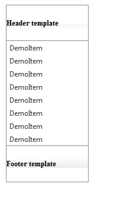

# Using Header and Footer Templates

## 

The Header and Footer templates let you specify custom header or footer that will appear at the top or, respectively, at the bottom of the listbox. You use the Header/Footer templates the same way as ItemTemplate or EmptyMessage template. Detailed instructions on how to use templates can be found [here](http://www.telerik.com/help/aspnet-ajax/listbox-templates-design-time.html).

>tip Note that Header and Footer templates of the RadListBox are available after 2010.2.7 version of the ASP.NET AJAX controls.
>

For example, consider the following markup:

````XML	    
<telerik:RadListBox RenderMode="Lightweight" runat="server" ID="DemoListBox">
	<HeaderTemplate>
		 <h5>Header template</h5>
	</HeaderTemplate>
	<Items>
		 <telerik:RadListBoxItem Text="DemoItem" />
		 <telerik:RadListBoxItem Text="DemoItem" />
		 <telerik:RadListBoxItem Text="DemoItem" />
		 <telerik:RadListBoxItem Text="DemoItem" />
		 <telerik:RadListBoxItem Text="DemoItem" />
		 <telerik:RadListBoxItem Text="DemoItem" />
		 <telerik:RadListBoxItem Text="DemoItem" />
		 <telerik:RadListBoxItem Text="DemoItem" />
	</Items>
	<FooterTemplate>
		 <h5>Footer template</h5>
	</FooterTemplate>
</telerik:RadListBox>				
````

It will render the following:


