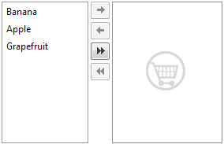

# Using the EmptyMessage Property

The **EmptyMessage** property lets you specify a string that will appear when the RadListBox contains no items.


## Setting the EmptyMessage server-side

````C#
protected void Page_Load(object sender, EventArgs e)
{
	RadListBox1.EmptyMessage = "No items added";
}				
````
````VB.NET
Protected Sub Page_Load(ByVal sender As Object, ByVal e As EventArgs)
	RadListBox1.EmptyMessage = "No items added"
End Sub	
````

## Setting the EmptyMessage inline

````ASPNET	    
<telerik:RadListBox RenderMode="Lightweight" ID="RadListBox2" runat="server"
	EmptyMessage="No items added">
</telerik:RadListBox> 	
````

## Controlling the appearance of the EmptyMessage text

To control the appearance of the **EmptyMessage** text you can add and change this CSS rule:

````XML	  
<style type="text/css">
	div.RadListBox .rlbEmptyMessage
	{
		font-weight : bold;
	}
</style> 	
````

In addition you can define your own template on how the empty message should look like by using the <**EmptyMessageTemplate**> tag. Just like the ItemTemplate you can place any html / asp.net controls in it and it will be shown when the RadListBox is empty. Here is an example:

````XML	        
<telerik:RadListBox RenderMode="Lightweight" ID="RadListBox1" runat="server"
   Height="180px"         
   AllowTransferOnDoubleClick="true"
   Skin="Vista"
   AllowTransfer="True"
   TransferToID="RadListBox2">
   <Items>
	   <telerik:RadListBoxItem Text="Banana" />
	   <telerik:RadListBoxItem Text="Apple" />
	   <telerik:RadListBoxItem Text="Grapefruit" />
   </Items>
</telerik:RadListBox>
<telerik:RadListBox RenderMode="Lightweight" ID="RadListBox2" runat="server"
   Height="180px" >
   <EmptyMessageTemplate>
	   
   </EmptyMessageTemplate>
</telerik:RadListBox> 	
````

And here is the result:



# See Also

 * [Overview]()
