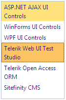

# Scroll Items Horizontally


## 

By default, the item's text is wrapped so the horizontal scrollbar does not appear if the text is long enough to go outside the listbox borders:



This article shows how to make the text of the items lie on one line thus showing the horizontal scrollbar. Here is the declaration:

````ASPNET
	     
	    <telerik:RadListBox ID="list1" runat="server"
	       Width="130px" Height="200px" Skin="Office2007">
	       <Items>
	           <telerik:RadListBoxItem Text="ASP.NET AJAX UI Controls" />
	           <telerik:RadListBoxItem Text="WinForms UI Controls" />
	           <telerik:RadListBoxItem Text="WPF UI Controls" />
	           <telerik:RadListBoxItem Text="Telerik Web UI Test Studio" Selected="true" />
	           <telerik:RadListBoxItem Text="Telerik Open Access ORM" />
	           <telerik:RadListBoxItem Text="Sitefinity CMS" />
	       </Items>
	    </telerik:RadListBox> 
````


Add the following CSS rules to the <HEAD> section of your page:

````XML
	     
	    <style type="text/css">
	    div.RadListBox .rlbText
	       {
	           white-space: nowrap;
	           display: inline-block;
	       }
	       div.RadListBox .rlbGroup
	       {
	           overflow: auto;
	       }
	       div.RadListBox .rlbList
	       {
	           display: inline-block;
	           min-width: 100%;
	       }
	       *+html div.RadListBox .rlbList
	       {
	           display: inline;
	       }
	       * html div.RadListBox .rlbList
	       {
	           display: inline;
	       }
	
	    </style> 
				
````


Now the listbox will have a horizontal scrollbar:


