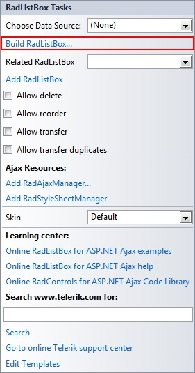
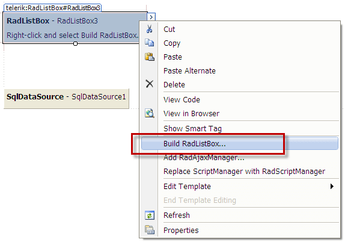

# Item Builder

The **RadListBox Item Builder** lets you add, edit, delete and set properties for items at design-time.

* From the **RadListBox** [Smart Tag](), click on the **Build RadListBox** link.

* Right-click on the **RadListBox** control and select **Build RadListBox** from the context menu.

## RadListBox Item Builder

There are two ways to bring up the RadListBox Item Builder:

* From the **RadListBox** [Smart Tag](), click on the **Build RadListBox** link.

* Right-click on the **RadListBox** control and select **Build RadListBox** from its pop-up menu.

You can add, edit, delete and re-arrange items:

You can also set various item's properties like: [Text, Value, Selected, Checked, Checkable, AllowDrag](), etc.

# See Also

 * [Smart Tag]()

 * [Template Editor]()
