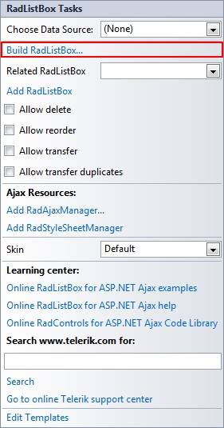
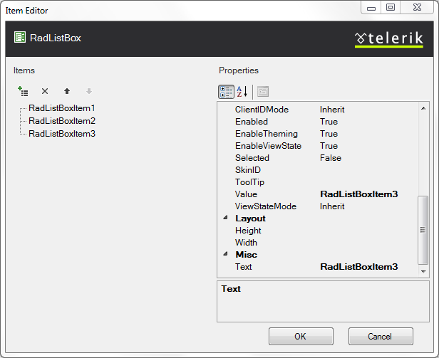

# Item Builder

The __RadListBox Item Builder__ lets you add, edit, delete and set properties for items at design-time.

* From the __RadListBox__[Smart Tag](), click on the __Build RadListBox__ link.

* Right-click on the __RadListBox__ control and select __Build RadListBox__ from the context menu.

## RadListBox Item Builder

There are two ways to bring up the RadListBox Item Builder:

* From the __RadListBox__[Smart Tag](), click on the __Build RadListBox__ link.

* Right-click on the __RadListBox__ control and select __Build RadListBox__ from its pop-up menu.

You can add, edit, delete and re-arrange items:

You can also set various item's properties like: [Text, Value, Selected, Checked, Checkable, AllowDrag](), etc.

# See Also

 * [Smart Tag]()

 * [Template Editor]()
