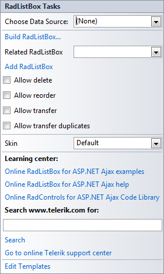
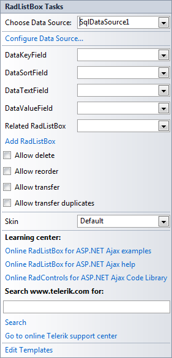

# Smart Tag

The __RadListBox__ Smart Tag allows easy access to frequently needed tasks. You can display the __Smart Tag__ by right clicking on a __RadListBox__ control in the design window, and choosing __Show Smart Tag.__

## Smart Tag of unbound RadListBox

When __RadListBox__ is unbound, the Smart Tag looks like the following:

Using the unbound __RadListBox__ Smart Tag you can perform the following:

## RadListBox Tasks

* __Choose Data Source__ lets you bind RadListBox declaratively by selecting a data source from a drop-down list of all available data source components. If you select __<New Data Source...>__ the standard Windows [Data Source Configuration Wizard](http://msdn2.microsoft.com/en-us/library/ms247282(VS.80).aspx) appears, where you can create and configure a data source component.

* __Build RadListBox__ opens the [RadListBox Item builder](), where you can add static items to the ListBox and set their properties.

* __Add RadListBox__ adds another RadListBox on the page related to the first one. Use this when you want to [transfer items]() between two RadListBox controls.

* __Skin__ lets you select from a list of available [skins]() to customize the look of your __RadListBox__.

## Learning Center

Links navigate you directly to RadListBox examples, help, or code library. You can also search the Telerik web site for a given string.

## Edit Templates

Clicking the __Edit Templates__ link brings up a [template editor]() where you can customize the Item Template.

## Smart Tag of bound RadListBox

When __RadListBox__ is bound to a data source, the Smart Tag looks like the following:

Using the Smart Tag of bound RadListBox____lets you perform any task you can perform with the Smart Tag of unbound RadListBox. In addition, you can choose __Configure Data Source...__ to open the standard [Data Source Configuration Wizard](http://msdn2.microsoft.com/en-us/library/ms247282(VS.80).aspx), where you can configure the currently bound data source component.

Once the Data Source is chosen, you can select each of the following: __DataKeyField__, __DataSortField__, __DataTextField__ and __DataValueField__. These should be fields in the Data Source which will serve data respectively for the primary key, sort order column and __Text__ and __Value__ properties of RadListBox Items.

# See Also

 * [Item Builder]()

 * [Template Editor]()
