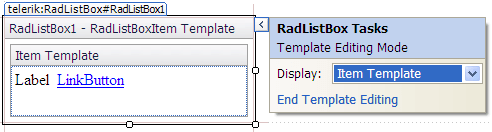
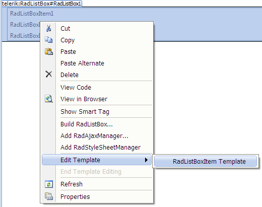

# Template Editor

## 

The **Template Design Surface** lets you design templates for the nodes that appear in RadListBox. There are two ways to display the Template Design Surface:

* From the RadListBox Smart Tag, choose Edit Templates. A Pop-up appears, along with the Template Design Surface:

* Right-click the RadListBox instance and from the context menu, select **Edit Template**.The **Template Design surface** appears.

On the design surface, you can drag any controls from the toolbox, as well as typing any literal text. By moving to Source view, you can add other HTML content to the template and set attributes to display the item's value.

When you have finished designing your template, choose **End Template Editing** from the listbox context menu or Smart Tag pop-up.

# See Also

 * [Smart Tag]()

 * [Item Builder]()
