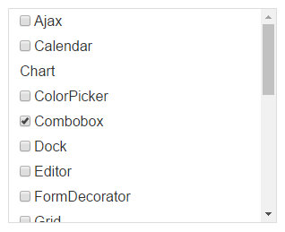
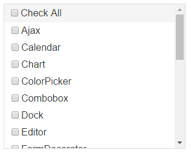

# Adding Images and Checkboxes to Items


You can easily add an image and/or a checkbox to the RadListBox item.


## Adding checkboxes to items

Set the **CheckBoxes** property of RadListBox to *True*. This will add a checkbox on the left of every list item.

* You can use the **Checked** property (True or False) of the list item to change its checked state.

* Use the **Checkable** property of the item if you need to hide the checkbox of that item.



````ASPNET
<telerik:RadListBox ID="RadListBox1" runat="server" RenderMode="Lightweight" CheckBoxes="true">
    <Items>
        <telerik:RadListBoxItem Text="Ajax" />
        <telerik:RadListBoxItem Text="Calendar" />
        <telerik:RadListBoxItem Checkable="false" Text="Chart" />
        <telerik:RadListBoxItem Text="ColorPicker" />
        <telerik:RadListBoxItem Checked="true" Text="Combobox" />
        <telerik:RadListBoxItem Text="Dock" />
    </Items>
</telerik:RadListBox>
````

## Showing the CheckAll checkbox

From Q3 2013 you can use a **CheckAll** checkbox functionality in RadListBox. You can set the **ShowCheckAll** property of RadListBox to *True* and if the **CheckBoxes** is also set to true the **CheckAll** checkbox will be shown at the top of all other items of RadListBox. It allows checking or unchecking all the items with a single click.



````ASPNET
<telerik:RadListBox ID="RadListBox1" runat="server" RenderMode="Lightweight" CheckBoxes="true" ShowCheckAll="true">
    <Items>
        <telerik:RadListBoxItem Text="Ajax" />
        <telerik:RadListBoxItem Text="Calendar" />
        <telerik:RadListBoxItem Text="Chart" />
        <telerik:RadListBoxItem Text="ColorPicker" />
        <telerik:RadListBoxItem Text="Combobox" />
        <telerik:RadListBoxItem Text="Dock" />
    </Items>
</telerik:RadListBox>
````


## Adding images to items

Set the **ImageUrl** property of the list items to the path to the image. Leave the property blank to have the item with no image.


````ASPNET
<telerik:RadListBox RenderMode="Lightweight" ID="RadListBox1" runat="server">
    <Items>
        <telerik:RadListBoxItem Text="Ajax" ImageUrl="images/Ajax.gif" />
        <telerik:RadListBoxItem Text="Calendar" ImageUrl="images/Calendar.gif" />
        <telerik:RadListBoxItem Text="Chart" ImageUrl="images/Chart.gif" />
        <telerik:RadListBoxItem Text="ColorPicker" ImageUrl="images/ColorPicker.gif" />
        <telerik:RadListBoxItem Text="Combobox" ImageUrl="images/Combobox.gif" />
        <telerik:RadListBoxItem Text="Dock" ImageUrl="images/Dock.gif" />
    </Items>
</telerik:RadListBox>
````


# See Also

 * [Overview]()

 * [Declaring the Items Inline]()

 * [Loading Items from XML]()

 * [Working at Server-side]()

 * [Working at Client-side]()

 * [Checkboxes Demo](https://demos.telerik.com/aspnet-ajax/listbox/examples/functionality/checkboxes/defaultcs.aspx)

 * [Text with Icons Demo](https://demos.telerik.com/aspnet-ajax/listbox/examples/functionality/textwithicons/defaultcs.aspx)
