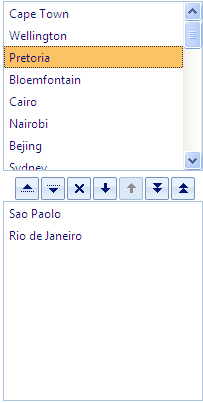
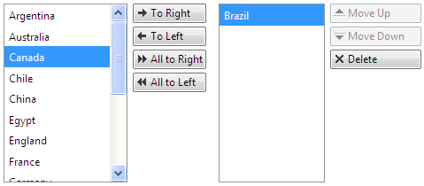

# Button Settings


You can control the way buttons are rendered using the __ButtonSettings__ property. You can change the position of the buttons, align them horizontally and vertically, set their width, height and visibility.

## ButtonSettings properties

* __Position__ - controls where the buttons will be placed relative to the listbox. Possible values are Bottom, Left, Right or Top.

````ASPNET
	    <telerik:radlistbox id="RadListBox1">     
	       <ButtonSettings AreaHeight="30" Position="Bottom" HorizontalAlign="Center" />         
	    </telerik:radlistbox>
````





* __HorizontalAlign__ - sets the horizontal alignment of the buttons when their __position__ is either Top or Bottom. Possible values are Center, Left and Right.

* __VerticalAlign__ - sets the vertical alignment of the buttons when their __position__ is either Left or Right. Possible values are: Bottom, Middle and Top.

* __AreaHeight__ - sets the height of the buttons when their __position__ is either Top or Bottom. Note that __AreaHeight__ value plus the height of the listbox equals the __Height__ property of the RadListBox.

* __AreaWidth__ - sets the width of the buttons when their __position__ is either Left or Right. Note that __AreaWidth__ value plus the width of the listbox equals the __Width__ property of the RadListBox.

* __RenderButtonText__ - When set to True (default is False) the text of the buttons is shown as well. To change the text of the buttons please see the [Localization]() article.




* __ShowDelete__ - when set to False the delete button will not be visible when __AllowDelete="True"__

* __ShowReorder -__when set to False the reorder buttons will not be visible when __AllowReorder="True"__

* __ReorderButtons -__enumeration which defines which reorder buttons will be displayed. Example: <ButtonSettings ReorderButtons="MoveToBottom,MoveDown">

* __ShowTransfer -__when set to False the transfer buttons (move left and move right) will not be visible when __AllowTransfer="True"__

* __ShowTransferAll -__when set to False the transfer all buttons will not be visible when __AllowTransfer="True"__

* __TransferButtons -__enumeration which defines which transfer buttons will be displayed. Example: <ButtonSettings TransferButtons="TransferAllFrom,TransferAllTo">

# See Also

 * [Online Demo](http://demos.telerik.com/aspnet-ajax/listbox/examples/functionality/buttons/defaultcs.aspx)

 * [Reorder]()

 * [Transfer]()

 * [Drag and Drop]()

 * [Localization]()
