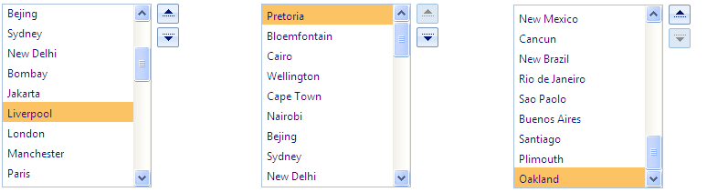

# Reorder

## 

**RadListBox** supports item reordering - you can move the item/items up and down using the provided UI buttons.

To enable item reordering set the **AllowReorder="True"** property of the listbox. This will show the up and down buttons next to the listbox:

When the first item is selected the up button is disabled. Similarly, when the last item is selected the down button is disabled.

You can control the look and feel of the reorder buttons by adjusting the [ButtonSettings properties]().

Additionally, you can reorder items using drag and drop. To do so you need to set the **EnableDragAndDrop="True"** property.

To fire a postback after clicking on the up or down buttons set the **AutoPostBackOnReorder="True"** property.

Several client and server events are fired upon reordering (when AutoPostBackOnReorder="True") in the following sequence:

>caption  

| Reorder (from Reorder buttons) | Reorder (using drag and drop) |
| ------ | ------ |
|[OnClientDropping]()(can be cancelled)||
|-|[OnClientDropped]()|
|[OnClientReordering]()(can be cancelled)|[OnClientReordering]()(can be cancelled)|
|[OnClientReordered]()|[OnClientReordered]()|
|-|[Dropping]()(can be cancelled)|
|-|[Dropped]()|
|[Reordering]()(can be cancelled)|[Reordering]()(can be cancelled)|
|[Updating]()(can be cancelled)|[Updating]()(can be cancelled)|
|[Updated]()|[Updated]()|
|[Reordered]()|[Reordered]()|

Please check [this help topic]() on how to **automatically update the database on reorder**.

# See Also

 * [Transfer]()

 * [Drag and Drop]()

 * [Button Settings]()

 * [Reordering]()

 * [Reordered]()

 * [OnClientReordering]()

 * [OnClientReordered]()

 * [Automatic Database Updates]()

 * [Reorder Demo](https://demos.telerik.com/aspnet-ajax/listbox/examples/functionality/reorder/defaultcs.aspx)
