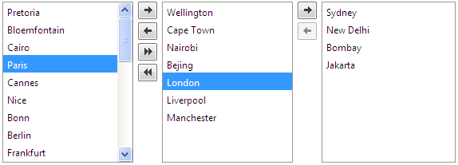

# Transfer

## 

**RadListBox** supports item transfer to another (related) **RadListBox**. By default, the selected item is **moved** from the source to the destination listbox. You can change that behavior by setting the **TransferMode="Copy"** property - in this way the item will be **copied** to the destination listbox.

To enable item transferring you need to:

1. Set the **AllowTransfer="True"** property. This will show the *move left* and *move right* buttons next to the listbox. You can control the look and feel of the transfer buttons by adjusting the [ButtonSettings properties]().

2. Set the **TransferToID** property to the ID of the destination (second, right) **RadListBox**. You can use the [Smart Tag]() to add that additional listbox - this will set the TransferToID property automatically.

3. [*Optional*] Set the **TransferMode** property to **Copy** if you want to copy instead of move the selected item/items from one listbox to the other. By default it is **Move**.

4. [*Optional*] Set the **AutoPostBackOnTransfer="True"** to fire a postback on transfer. Required when using `ItemTemplate`. In such a case you must also call the `DataBind()` method of each item in the [Transferred event]() of the source listbox.

5. [*Optional*] Set the **AllowTransferOnDoubleClick="True"** to transfer the item when you double click it.

Please check [this help topic]() on how to **automatically update the database on transfer**.

# See Also

 * [Reorder]()

 * [Drag and Drop]()

 * [Button Settings]()

 * [Localization]()

 * [Transfer Demo](https://demos.telerik.com/aspnet-ajax/listbox/examples/functionality/transfer/defaultcs.aspx)
