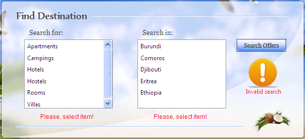

# Validation

You can use the built in ASP.NET validation with **RadListBox**.

## Validating RadListBox with RequiredFieldValidator

To validate for selected item of a listbox, just specify the ID of the listbox in the **ControlToValidate** property of the **RequiredFieldValidator**. Validation checks to see if there is at least one selected item.

````ASPNET
<telerik:RadListBox runat="server" ID="RadListBox1"> 
	<Items>  
	<telerik:RadListBoxItem Text="Apartments" />  
	<telerik:RadListBoxItem Text="Campings" />  
	<telerik:RadListBoxItem Text="Hotels" />  
	<telerik:RadListBoxItem Text="Hostels" />  
	<telerik:RadListBoxItem Text="Rooms" />  
	<telerik:RadListBoxItem Text="Villas" />
	</Items>
</telerik:RadListBox>

<asp:RequiredFieldValidator runat="server" ID="RequiredFieldValidator1" ErrorMessage="Please, select item!" ControlToValidate="RadListBox1" />				
````

If no item is selected, the validator fails and displays the error message:



# See Also

 * [Validation Demo](http://demos.telerik.com/aspnet-ajax/listbox/examples/functionality/validation/defaultcs.aspx)
