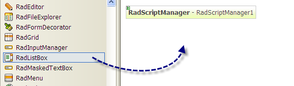
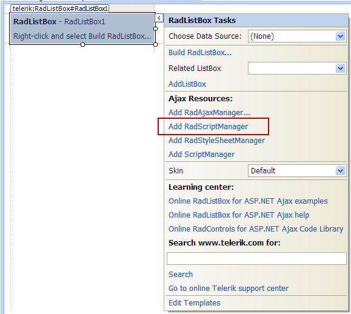

# Getting Started


## 

This tutorial will show you how to:

* create two related RadListBox controls

* allow drag and drop between the above listbox controls

1. In a new AJAX Enabled Web Site, drop a RadListBox to the default form.



2. From the [Smart Tag]() click on the Add RadScriptManager link. It will automatically register the handler in the web.config file.




3. Click on the Build RadListBox link to open the [Item Builder](). Now use it to add several items:


4. Click on the __Add RadListBox__ link. This will add another RadListBox on the page and will set the __TransferToID__ property of the first listbox to the ID of the second listbox. This is needed for the [transfer]() and [drag and drop]() operations.

5. Set the __AllowReorder="True", AllowTransfer="True" and EnableDragAndDrop="True"__ properties of the first RadListBox. This will show the necessary transfer and reorder buttons between the two listboxes so you will be able to reorder the items (move up and move down) and transfer the items (from the left to the right control and vice versa). In addition you will be able to use the mouse to drag and drop an item between the two listboxes or inside the RadListBox.

6. Select your favorite skin from the __Skin__ dropdown to change the look and feel of the listbox.

7. Set the __Height__ and __Width__ properties of the listboxes so they look the same.

8. Run the project - now you can move the items up and down, left and right with the buttons. You can also drag and drop the items. In addition, you can move all items from right to left or vice versa with a single button click.


9. To get the destination items iterate the __Items__ collection of the second listbox using the foreach statement:

>tabbedCode

````C#
	     
	
	    foreach (RadListBoxItem item in RadListBox2.Items)
	    {
	        // do your stuff with the item
	    }
				
````
````VB.NET
	     
	
	    For Each item As RadListBoxItem In RadListBox2.Items
	    Next
	
				
````
>end

# See Also

 * [Overview]()
