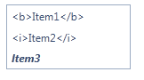
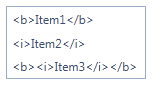

# Escape HTML Tags in the Text of the Items When They Are Created on the Client-side
## 

Sometimes is needed to add html tags in the text of the RadListBox items. By default when this is done from the mark-up, when data binding or from the server-side these html tags are not rendered by the browse. They are presented as a plain text along with the other characters of the RadListBox’s item.

````ASPNET
<telerik:radlistbox id="RadListBox1" runat="server" skin="Office2010Blue">
		<Items>
			<telerik:RadListBoxItem Text="<b>Item1</b>" />
			<telerik:RadListBoxItem Text="<i>Item2</i>" />
		</Items>
</telerik:radlistbox>
````

````JavaScript
<script type="text/javascript">
	function pageLoad() {
		var newItem = new Telerik.Web.UI.RadListBoxItem();
		newItem.set_text("<b><i>Item3</i></b>");
		var listbox = $find("<%= RadListBox1.ClientID %>")
		listbox.get_items().add(newItem);
	}
</script>
````



This functionality is not presented when adding items on the client-side. When this is done the browser renders the html tags. In order to deal with this limitation one should escape the text containing these tags using the implementation suggested below:

````ASPNET
<telerik:radlistbox id="RadListBox1" runat="server" skin="Office2010Blue">
		<Items>
			<telerik:RadListBoxItem Text="<b>Item1</b>" />
			<telerik:RadListBoxItem Text="<i>Item2</i>" />
		</Items>
</telerik:radlistbox>
````

````JavaScript
<script type="text/javascript">
	function pageLoad() {
		var newItem = new Telerik.Web.UI.RadListBoxItem();
		newItem.set_text(encode("<b><i>Item3</i></b>"));
		var listbox = $find("<%= RadListBox1.ClientID %>")
		listbox.get_items().add(newItem);
	}

	function encode(value) {
		return Replace(value, {
			'&': '&amp;',
			'<': '&lt;',
			'>': '&gt;'
		});
	}

	function Replace(value, substitutes) {
		for (var substitute in substitutes)
			value = value.replace(new RegExp(substitute, 'g'), substitutes[substitute]);

		return value;
	}
</script>
````



If the newly added items will be persisted upon post-back, additional action should be performed. The approach is shown bellow:

````ASPNET
<telerik:radlistbox id="RadListBox1" runat="server" skin="Office2010Blue">
		<Items>
			<telerik:RadListBoxItem Text="<b>Item1</b>" />
			<telerik:RadListBoxItem Text="<i>Item2</i>" />
		</Items>
</telerik:radlistbox>
````

````JavaScript
function pageLoad() {
	var newItem = new Telerik.Web.UI.RadListBoxItem();
	newItem.set_text(encode("<b><i>Item3</i></b>"));
    newItem.get_attributes().setAttribute("Encoded", "encoded");
	var listbox = $find("<%= RadListBox1.ClientID %>")
	listbox.trackChanges();
	listbox.get_items().add(newItem);
	listbox.commitChanges();
}

function encode(value) {
	return Replace(value, {
		'&': '&amp;',
		'<': '&lt;',
		'>': '&gt;'
	});
}

function Replace(value, substitutes) {
	for (var substitute in substitutes)
		value = value.replace(new RegExp(substitute, 'g'), substitutes[substitute]);

	return value;
}
````

````C#
protected void Page_Load(object sender, EventArgs e)
{
	foreach (RadListBoxItem item in RadListBox1.Items)
	{
		if (item.Attributes["Encoded"] == "encoded")
		{
			item.Text = System.Web.HttpUtility.HtmlDecode(item.Text);
		}
	}
}	
````
````VB.NET	
Protected Sub Page_Load(ByVal sender As Object, ByVal e As EventArgs)
	For Each item As RadListBoxItem In RadListBox1.Items
		If item.Attributes("Encoded") = "encoded" Then
			item.Text = System.Web.HttpUtility.HtmlDecode(item.Text)
		End If
	Next
End Sub
````

# See Also
