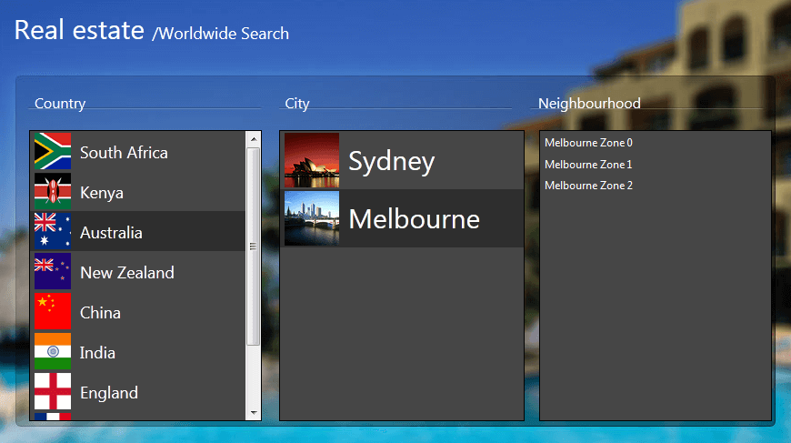

# ListBox Overview

**RadListBox** is a powerful ASP.NET AJAX control to display a list of items. It allows for multiple selection of items, [reorder]() and [transfer]() between two RadListBox controls. [Drag and drop]() is fully supported as well. You can easily control the appearance by [arranging the buttons]() in different layouts or [changing their text](). [Icons and checkboxes]() are also supported within RadListBox items. **RadListBox** implements a highly efficient semantic rendering, which uses list items and CSS instead of tables. As a result the HTML output is significantly reduced, which dramatically improves performance.

**RadListBox** can be bound to all ASP.NET 2.0 [declarative datasources]() (ObjectDataSource, XmlDataSource, SqlDataSource, etc) as well as the ASP.NET 3.5 [LinqDataSource]() and [EntityDataSource](). [Binding to XML strings]() as well as [automatic database updates]() are fully supported.

## 

**RadListBox** has a [rich client-side API]() and [comprehensive set of events]() guaranteeing full control over various functions performed on the client. You can easily [add/delete/update]() items at the client side and all the changes will be persisted on the server as well. The rich client-side API provides unbeatable performance and desktop-like experience.

**RadListBox** is shipped with a rich set of [skins]() that allow you to easily build slick interfaces with the look-and-feel of Windows Vista, Office 2007, Outlook, etc. The skins can be easily switched using a single property.

# See Also

 * [Getting Started]()

 * [Overview]()

 * [Overview]()

 * [Overview]()

 * [RadListBox product details page](https://www.telerik.com/products/aspnet-ajax/listbox.aspx)

 * [RadListBox Demos](https://demos.telerik.com/aspnet-ajax/listbox/examples/overview/defaultcs.aspx)
