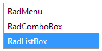

# Declaring the Items Inline

The definition of __RadListBox__ items can be added to the in-line declaration of the ListBox using the __RadListBox Item Builder__. The item builder updates the ASPX or ASCX file to include the list of items and their properties.

You can also directly edit the ASPX or ASCX file by adding items to the <Items></Items> section of the __RadListBox__ declaration. Every item definition must be enclosed in \<telerik:RadListBoxItem\> and \</telerik:RadListBoxItem\> tags.

## Example

Add the following __inline__ definition of RadListBox to your ASPX or ASCX file:

````ASPNET
<telerik:RadListBox ID="RadListBox2"
   runat="server"
   Skin="Vista">
   <Items>
	   <telerik:RadListBoxItem Text="RadMenu" />
	   <telerik:RadListBoxItem Text="RadComboBox" />
	   <telerik:RadListBoxItem Text="RadListBox" Selected="true" />
   </Items>
</telerik:RadListBox> 
````


At run-time the result will be:



# See Also

 * [Overview]()

 * [Loading Items from XML]()

 * [Overview]()

 * [Item Builder]()
