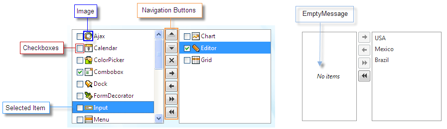

# Structure

## 

The structure of the **RadListBox** control is as follows:

RadListBox items can contain [checkboxes and/or images](). The navigation buttons are rendered depending on the boolean [AllowReorder](), AllowDelete, [AllowTransfer]() properties. You can easily can [change their position]() and/or [add custom text]() to them. When RadListBox has no items - you can show a friendly message by using the **EmptyMessage** property.

# See Also

 * [Overview]()

 * [Getting Started]()
