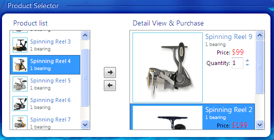

# Templates Overview

Templates allow you to embed any context inside a RadListBoxItem. For example:

* HTML markup

* ASP.NET server controls

* other third-party controls (other Telerik RadControls for ASP.NET Ajax for example)

## When to use Templates

Normally, **RadListBox** allows great flexibility with regard to the functionality and appearance of your items. Use Templates to embed complex elements (such as ASP .NET controls) inside your list items. Templates are also a great way to avoid setting too many properties to each list item explicitly. The example below shows images, text and RadNumericTextBox embedded in the RadListBox ItemTemplate:



Here is the declaration:

>caution Please have in mind that it is not possible to transfer items on the client-side when templates are used. This means that the **AutoPostbackOnTransfer** must be set to **true** when one wants to use transfer and templates at the same time.
>

````C#	
<telerik:RadListBox ID="RadListBox3" runat="server" AllowTransfer="true" AutoPostBackOnTransfer="true"
	Height="200px" OnTransferred="RadListBox1_Transferred" SelectionMode="Multiple"
	TransferToID="RadListBox2" Width="215px">
<ButtonSettings ShowTransferAll="false" VerticalAlign="Middle" />
<ItemTemplate>
	 ' />
	 <span class="product-title">
	  <%# DataBinder.Eval(Container, "Text")%></span> <span class="bearing">1 bearing</span>
</ItemTemplate>
<Items>
	 <telerik:RadListBoxItem Text="Spinning Reel 1" Value="reel1_thumb.png" Price="99" Selected="true" />
	 <telerik:RadListBoxItem Text="Spinning Reel 2" Value="reel2_thumb.png" Price="199" />
	 <telerik:RadListBoxItem Text="Spinning Reel 3" Value="reel3_thumb.png" Price="99" />
	 <telerik:RadListBoxItem Text="Spinning Reel 4" Value="reel4_thumb.png" Price="299" />
	 <telerik:RadListBoxItem Text="Spinning Reel 5" Value="reel5_thumb.png" Price="199" />
	 <telerik:RadListBoxItem Text="Spinning Reel 6" Value="reel6_thumb.png" Price="99" />
	 <telerik:RadListBoxItem Text="Spinning Reel 7" Value="reel7_thumb.png" Price="299" />
	 <telerik:RadListBoxItem Text="Spinning Reel 8" Value="reel8_thumb.png" Price="199" />
</Items>
</telerik:RadListBox>

<telerik:RadListBox runat="server" ID="RadListBox4" Height="200px" Width="270px"
	SelectionMode="Multiple">
<ItemTemplate>
	 ' />
	 <span class="detail-title">
	  <%# DataBinder.Eval(Container, "Text")%></span> <span class="bearing">1 bearing</span>
	 <ul class="details">
	  <li>
	   <label>
		Price:</label>
	   <span>
		<%# Convert.ToInt32(DataBinder.Eval(Container, "Attributes['Price']")).ToString("C0") %></span>
	  </li>
	  <li>
	   <label>
		Quantity:</label>
	   <telerik:RadNumericTextBox runat="server" ID="QuantityTextBox" Width="40px" MinValue="1"
		MaxValue="10" ShowSpinButtons="true" Value="1" NumberFormat-DecimalDigits="0" />
	  </li>
	 </ul>
</ItemTemplate>
<Items>
	<telerik:RadListBoxItem Text="Spinning Reel 9" Value="reel9.png" Price="99" />     
</Items>
</telerik:RadListBox>      	
````

An \<ItemTemplate\> section is added to the **RadListBox** declaration. The image in the template and the text that appears in the template is taken from the RadListBoxItem using <%# DataBinder.Eval %> statements.

Before the template can use the ListBox item properties to bind the elements in the template, the application needs to explicitly bind the items by calling the **DataBind** method of RadListBox:

````C#
protected void Page_Load(object sender, EventArgs e)
{
	if (!Page.IsPostBack)
	{
		RadListBox1.DataBind();
		RadListBox2.DataBind();
	}
}	
````
````VB.NET
Protected Sub Page_Load(ByVal sender As Object, ByVal e As EventArgs)
	If Not Page.IsPostBack Then RadListBox1.DataBind(RadListBox2.DataBind())
	End If
End Sub	
````

# See Also

 * [Templates Demo](http://demos.telerik.com/aspnet-ajax/listbox/examples/functionality/templates/defaultcs.aspx)

 * [Working with Templates at Design Time]()

 * [Working with Templates at Runtime]()

 * [Using the EmptyMessage Property]()
