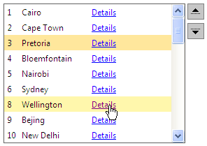
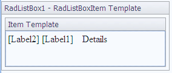

# Working with Templates at Design Time

## 

You can add a template using the [Template Design Surface](). This provides you with a surface where you can visually design the template, dragging and dropping controls from the toolbox.

This example shows how to use the Template Design Surface to add **several controls** to the ItemTemplate. These will be two labels and a hyperlink control achieving the following multi-column layout:



1. Drag a **RadListBox** from the toolbox onto your Web page.

2. From the Smart Tag that appears when you drop the **RadListBox**, choose **Edit Templates**.

3. The Template Design Surface appears, set for editing the **ItemTemplate**.

4. Drag two labels and one hyper link controls from the toolbox onto the Template Design Surface:



5. Edit the DataBindings of these controls so they are populated appropriately:

````ASPNET
<ItemTemplate>
   <asp:Label ID="Label2" runat="server" Text='<%# Eval("ID") %>'
	   CssClass="idClass" ></asp:Label>
   <asp:Label ID="Label1" runat="server" Text='<%# Eval("Name") %>' CssClass="list"></asp:Label>
   <asp:HyperLink ID="HyperLink1" runat="server"
	   NavigateUrl='<%# "Details.aspx?ID=" + Eval("ID") %>' Text='Details' CssClass="list" ></asp:HyperLink>        
</ItemTemplate> 
````

6. Use the Smart Tag anchor to display the Edit Templates pop-up, and choose **End Template Editing** to close the Template Design Surface.

7. From the [Smart Tag]() add some items to RadListBox or [bind it to a datasource](). At this point, the declaration for your RadListBox should look as follows:

````ASPNET
<telerik:RadListBox RenderMode="Lightweight" Height="200px" AllowReorder="true"
   Width="290px"
   ID="RadListBox1"
   runat="server"
   Skin="Simple"
   DataSourceID="SqlDataSource1"
   DataTextField="Name"
   DataValueField="ID" >    
   <ItemTemplate>
	   <asp:Label ID="Label3" runat="server" Text='<%# Eval("ID") %>'
		   CssClass="idClass" ></asp:Label>
	   <asp:Label ID="Label4" runat="server" Text='<%# Eval("Name") %>' CssClass="list"></asp:Label>
	   <asp:HyperLink ID="HyperLink2" runat="server"
		   NavigateUrl='<%# "Details.aspx?ID=" + Eval("ID") %>' Text='Details' CssClass="list" ></asp:HyperLink>        
   </ItemTemplate>
</telerik:RadListBox> 
````

7.1. Add the following CSS rules to the <head> section of your page:

````XML
<style type="text/css">
	.list {
	   float: left;
	   width: 100px;            
	   }
	.idClass {
	   float: left;
	   width: 20px;
	}
</style> 
````

8. Run the application. You will see that every RadListBox item will contain two labels and a hyperlink as shown in the image above.

# See Also

 * [Overview]()

 * [Working with Templates at Runtime]()
