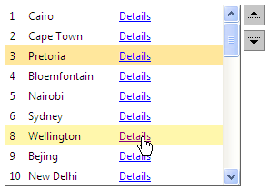

# Working with Templates at Runtime


## 

In addition to [adding templates at design time](), you can also add templates to __RadListBox__ at runtime using the __ItemTemplate__ property.


>note The RadListBox items should be dynamically added so that Templates can be defined at run time.
>Also, the __items should be bound__ to be able to eval DataBinder expressions. In other words, you should call the __DataBind__ method of the RadListBox object or bind the items that are about to use __DataBinder.Eval__ . You can bind a specific item by calling the __DataBind__ method of this specific item.
>


>note The __ItemTemplate__ should be initialized in the __OnInit__ event of the page. This is needed as the Template should be instantiated before the RadListBox items are initialized.
>


>tabbedCode

````C#
	
	    protected override void OnInit(EventArgs e)
	    {
	        RadListBox2.ItemTemplate = new MultiColumnListBoxTemplate();
	        base.OnInit(e);
	    }
	    protected void Page_Load(object sender, EventArgs e)
	    {
	        if (!Page.IsPostBack)
	        {
	            RadListBox2.DataSourceID = "SqlDataSource1";
	            RadListBox2.DataTextField = "Name";
	            RadListBox2.DataValueField = "ID";
	            RadListBox2.DataBind();
	        }
	    }
	    class MultiColumnListBoxTemplate : ITemplate
	    {
	        public void InstantiateIn(Control container)
	        {
	            Label id = new Label();
	            id.ID = "idLabel";
	            id.CssClass = "idClass";
	            id.DataBinding += new EventHandler(id_DataBinding);
	            container.Controls.Add(id);
	            Label name = new Label();
	            name.ID = "nameLabel";
	            name.CssClass = "list";
	            name.DataBinding += new EventHandler(name_DataBinding);
	            container.Controls.Add(name);
	            HyperLink details = new HyperLink();
	            details.ID = "details";
	            details.CssClass = "list";
	            details.Text = "Details";
	            details.DataBinding += new EventHandler(details_DataBinding);
	            container.Controls.Add(details);
	        }
	        private void id_DataBinding(object sender, EventArgs e)
	        {
	            Label target = (Label)sender;
	            RadListBoxItem item = (RadListBoxItem)target.BindingContainer;
	            string id = Convert.ToString((int)DataBinder.Eval(item.DataItem, "ID"));
	            target.Text = id;
	        }
	        private void name_DataBinding(object sender, EventArgs e)
	        {
	            Label target = (Label)sender;
	            RadListBoxItem item = (RadListBoxItem)target.BindingContainer;
	            string name = (string)DataBinder.Eval(item.DataItem, "Name");
	            target.Text = name;
	        }
	        private void details_DataBinding(object sender, EventArgs e)
	        {
	            HyperLink target = (HyperLink)sender;
	            RadListBoxItem item = (RadListBoxItem)target.BindingContainer;
	            string id = Convert.ToString((int)DataBinder.Eval(item.DataItem, "ID"));
	            target.NavigateUrl = "Details.aspx?ID=" + id;
	        }
	    } 
````


````VB.NET
	     
	    Partial Public Class Templates
	        Inherits System.Web.UI.Page
	        Protected Overloads Overrides Sub OnInit(ByVal e As EventArgs)
	            RadListBox2.ItemTemplate = New MultiColumnListBoxTemplate()
	            MyBase.OnInit(e)
	        End Sub
	        Protected Sub Page_Load(ByVal sender As Object, ByVal e As EventArgs)
	            If Not Page.IsPostBack Then
	                RadListBox2.DataSourceID = "SqlDataSource1"
	                RadListBox2.DataTextField = "Name"
	                RadListBox2.DataValueField = "ID"
	                RadListBox2.DataBind()
	            End If
	        End Sub
	        Class MultiColumnListBoxTemplate
	            Implements ITemplate
	            Public Sub InstantiateIn(container As System.Web.UI.Control) Implements System.Web.UI.ITemplate.InstantiateIn
	
	                Dim id As New Label()
	                id.ID = "idLabel"
	                id.CssClass = "idClass"
	                AddHandler id.DataBinding, AddressOf id_DataBinding
	                container.Controls.Add(id)
	                Dim name As New Label()
	                name.ID = "nameLabel"
	                name.CssClass = "list"
	                AddHandler name.DataBinding, AddressOf name_DataBinding
	                container.Controls.Add(name)
	                Dim details As New HyperLink()
	                details.ID = "details"
	                details.CssClass = "list"
	                details.Text = "Details"
	                AddHandler details.DataBinding, AddressOf details_DataBinding
	                container.Controls.Add(details)
	            End Sub
	            Private Sub id_DataBinding(ByVal sender As Object, ByVal e As EventArgs)
	                Dim target As Label = DirectCast(sender, Label)
	                Dim item As RadListBoxItem = DirectCast(target.BindingContainer, RadListBoxItem)
	                Dim id As String = Convert.ToString(DirectCast(DataBinder.Eval(item.DataItem, "ID"), Integer))
	                target.Text = id
	            End Sub
	            Private Sub name_DataBinding(ByVal sender As Object, ByVal e As EventArgs)
	                Dim target As Label = DirectCast(sender, Label)
	                Dim item As RadListBoxItem = DirectCast(target.BindingContainer, RadListBoxItem)
	                Dim name As String = DirectCast(DataBinder.Eval(item.DataItem, "Name"), String)
	                target.Text = name
	            End Sub
	            Private Sub details_DataBinding(ByVal sender As Object, ByVal e As EventArgs)
	                Dim target As HyperLink = DirectCast(sender, HyperLink)
	                Dim item As RadListBoxItem = DirectCast(target.BindingContainer, RadListBoxItem)
	                Dim id As String = Convert.ToString(DirectCast(DataBinder.Eval(item.DataItem, "ID"), Integer))
	                target.NavigateUrl = "Details.aspx?ID=" + id
	            End Sub
	        End Class
	    End Class
````


>end

The end result is:




If you for some reason cannot define the template in the __OnInit__ event of the page, you could use another approach:

>note The template has to be instantiated for each item upon a postback. Since the __MultiColumnListBoxTemplate__ class initializes the controls on InstantiateIn we call the InstantiateIn method of the __MultiColumnListBoxTemplate__ object for each item.
>


Alternatively, you can add controls directly to the __Controls__ collection of __RadListBoxItem__:

>tabbedCode

````C#
	
	    protected void Page_Load(object sender, EventArgs e)
	    {
	        RadListBoxItem item = new RadListBoxItem();
	        Label id = new Label() { Text = "1" };
	        id.CssClass = "idClass";
	        item.Controls.Add(id);
	        Label name = new Label() { Text = "USA" };
	        name.CssClass = "list";
	        item.Controls.Add(name);
	        HyperLink details = new HyperLink();
	        details.Text = "Details";
	        details.CssClass = "list";
	        details.NavigateUrl = "Details.aspx?ID=1";
	        item.Controls.Add(details);
	
	        RadListBox3.Items.Add(item);
	        RadListBox3.DataBind();
	    } 
	
````


````VB.NET
	     
	
	    Protected Sub Page_Load(ByVal sender As Object, ByVal e As EventArgs)
	        Dim item As New RadListBoxItem()
	        Dim id As New Label()
	        id.CssClass = "idClass"
	        item.Controls.Add(id)
	        Dim name As New Label()
	        name.CssClass = "list"
	        item.Controls.Add(name)
	        Dim details As New HyperLink()
	        details.Text = "Details"
	        details.CssClass = "list"
	        details.NavigateUrl = "Details.aspx?ID=1"
	        item.Controls.Add(details)
	        RadListBox3.Items.Add(item)
	        RadListBox3.DataBind()
	    End Sub
	
````


>end

# See Also

 * [Overview]()

 * [Working with Templates at Design Time]()
