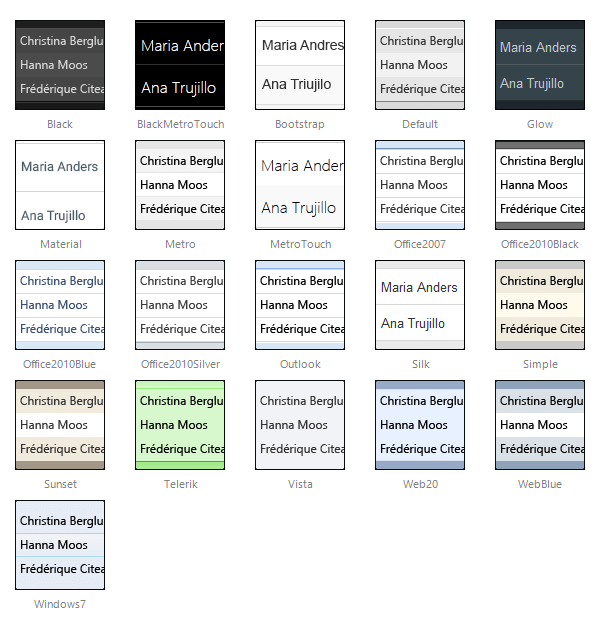

# Skins


The predefined layouts of RadListView, which in turn have a predefined HTML rendering, enable you to use the control's embedded skins to achieve a consistent look of RadListView with the other Telerik controls on the page.

Below is a set of some of the Telerik RadListView skins:
 


 @[template - Material skin is available only in Lightweight mode](/_templates/common/skins-notes.md#material-only-in-lightweight) 


## Changing the RadListView skin

The predefined layouts of RadListView are generated in design time and the CSS class, which carries the skin information is hard-coded in the LayoutTemplate. So, in order to change the control's skin at runtime, you need to use a binding expression for the skin-specific CSS class:

````ASP.NET
	    <telerik:RadListView ID="RadListView1" runat="server">
	        <LayoutTemplate>
	            <div class="RadListView RadListView_<%#Container.Skin %>">
	                ...
	            </div>
	        </LayoutTemplate>
	    </telerik:RadListView>
````


In addition, after changing the Skin property value at runtime, you must rebind the control:

````C#
	    RadListView1.Skin = "AnotherSkin";
	    RadListView1.Rebind();
````


If you change the RadListView skin manually in source code view, you must also change the skin-specific CSS class to match the new skin name (unless you are using a binding expression as shown above).

## RadListView CSS classes

The CSS classes defined in the RadListView embedded skins are:


| CSS class | Description |
| ------ | ------ |
|RadListView|applied to the control's wrapper, does not depend on the skin name|
|RadListView_SkinName|applied to the control's wrapper, depends on the skin name|
|rlvI|applied to regular items|
|rlvA|applied to alternating items|
|rlvISel|applied to selected items|
|rlvIEdit|applied to items in edit mode|
|rlvIEmpty|applied to empty items in a group|
|rlvIGroup|applied to group items|
|rlvHeader|applied to the header row of the grid predefined layout|
|rlvBAdd|applied to the ADD button|
|rlvBUpdate|applied to the UPDATE button|
|rlvBCancel|applied to the CANCEL button|
|rlvBSel|applied to the SELECT button|
|rlvBDel|applied to the DELETE button|
|rlvBEdit|applied to the EDIT button|

Apart from the predefined RadListView layouts, the above CSS classes can also be used in custom layouts. If used correctly, they should produce a similar appearance on the respective HTML elements. For example, the **rlvA** CSS class always defines a background color for alternating items, so you can set this CSS class to a random element that you use as a wrapper for the alternating items - div, li, table, td, etc.

In addition, some of the above CSS classes participate in different CSS rules, depending on the element that they are applied to. For example, if the **rlvA** CSS class is applied to a table row element, it will set borders for nested table cells, and if it is applied to a table cell, it will set borders to it.

In order to be able to use the native RadListView CSS classes in custom layouts, you should have at least basic knowledge of CSS selectors and CSS specificity. Using Firebug to test the custom layout and any styling issues that might occur, is recommended.
