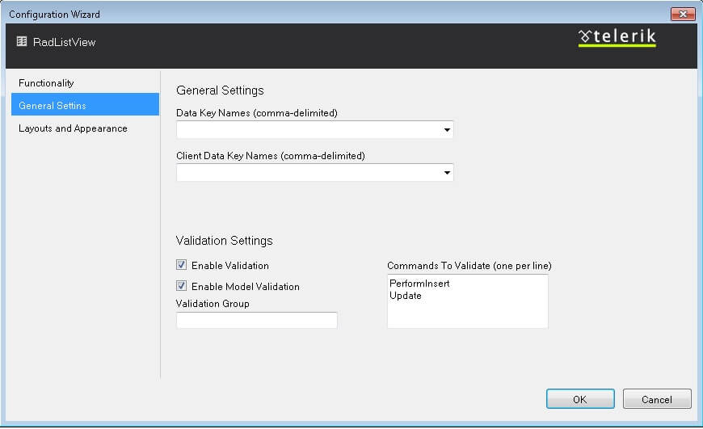

# Design Time

__RadListView's__ rich design-time interface allows to configure the control's layout with ease. Even if you do not have any knowledge, the integrated __Layout editor__ will help you choose predefined layout in codeless manner. You can open __RadListView's__* Designer *window by clicking on the __SmartTag__.

## Layout editor

The __Layout editor__ allows you to configure the __RadListView__ control. Apart from the item layout, the configuration window will help you enable/setup the desired set of options (*Paging*, *Sorting*, etc) and the default skin.

For more information about the layouts, please visit the following links:

[ Predefined layouts ](http://demos.telerik.com/aspnet-ajax/listview/examples/appearancestyling/predefinedlayouts/defaultcs.aspx)

[ Custom layouts ](http://demos.telerik.com/aspnet-ajax/listview/examples/appearancestyling/customlayouts/defaultcs.aspx)
