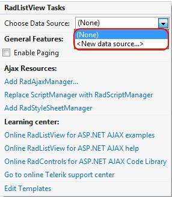
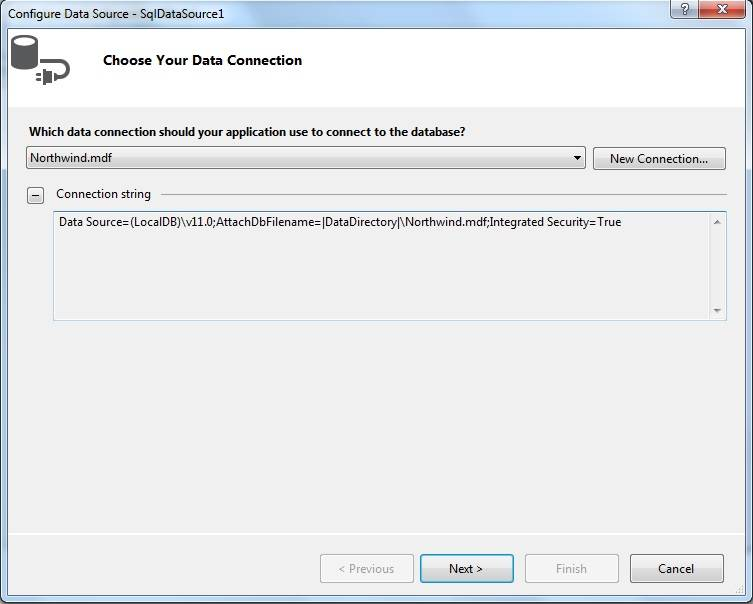
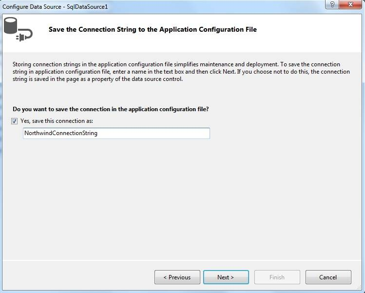
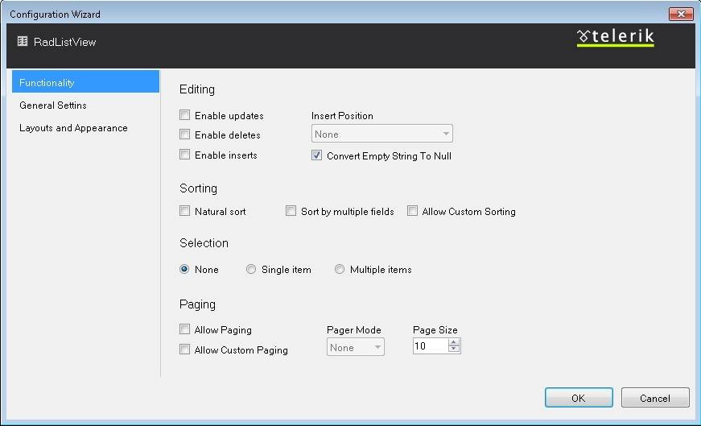
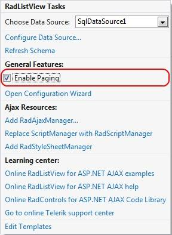
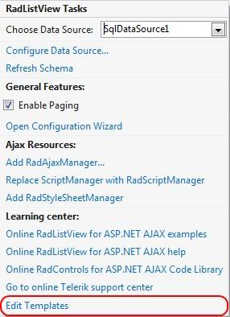

# Getting Started

## 

This tutorial will walk you through creating a Web page that contains a RadListView control. It shows how to:

* Bind RadListView using a declarative data source.

* Configure the control to support the most common features including: data-binding, setting a predefined layout, paging, adding templates

## Creating and Binding the RadListView

1. Locate the "..\Live Demos\App_Data" folder underneath the folder where you have installed your controls. In this folder, find the "Northwind.mdf" file, and copy it into the **App_Data** folder of your Web site/application. The **Solution Explorer** for you application should look something like the following:

1. Using the **RadListView**[ Smart tag](), expand the drop-down list labelled Choose Data Source and select **<New data source...>**:

1. The **Data Source Configuration Wizard** appears. On the **Choose a Data Source Type** page, select "SQL Database" and click **OK**:

1. On the Choose Your Data Connection page, click on the drop-down list to expand it and choose Northwind.mdf(This is the file that you copied earlier). Then click the Next button:

1. On the Save the Connection String to the Application Configuration File page, check the option "Yes, save this connection as:" and set name for the connection string. After that click the Next button:

1. On the Configure Select Statement page, select the "Customers" table from the drop-down list, and select the "CustomerID","CompanyName", "ContactName", "Address", and "City" fields. Then choose Next:

1. On the Test Query page, click the Test Query button to see the data. Then click Finish, to exit the Configure Data Source wizard:

## Predefined layouts

**RadListView**offers six **predefined layouts** that enable you to display your data as a/an:

* Grid

* Unordered list

* Ordered list

* Flow pattern

* Single row pattern

* Floated tiles

1. In order to take advantage of this feature of RadListView's you need to use the smart tag control designer and pick the **Open Configuration Wizard** option:

1. The designer will open a Configuration Manager window where you can adjust two types of options:

* Functionality

1. From the functionality window, you could:

* Enable/Disable automatic CRUD operations

* Enable/Disable and change the style of the pager for RadListView

* Set sorting

* Choose different selection modes

1. Layouts and Appereance

1. From the Layouts and Appereance window you could:

* Change the layout

* Apply a skin to RadListView

## Paging

1. In order to turn the paging on you must check the [Enable Paging] box. This will enable the integrated paging of Telerik RadListView.

## Adding Templates

1. In the Smart Tag select "Edit Templates"

1. RadListView for ASP.NET AJAX exposes a variety of templates that can be used to model the look and feel of its source data and layout. The most general template of RadListView is its **LayoutTemplate**. It specifies the overall appearance of the control, the outer wrapper that will be used for the control rendering, as well as the holder of its content.

1. The **EditItemTemplate**and **InsertItemTemplate**of RadListView determine what controls will be rendered to allow end user input when they are editing the data in the list view, or adding new data. Since those are templates, you are free to customize their layout according to your custom conventions.
