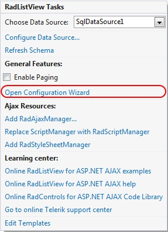
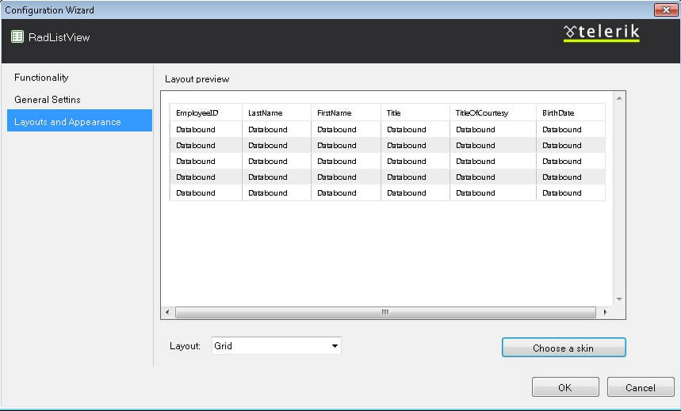

# Predefined


## 

__RadListView__gives you the opportunity to specify custom layouts and thus display your data in any preferable way. In addition, as a greater convenience to the developer, the control offers six __predefined layouts__ that enable you to display your data as a/an:

* Grid

* Unordered list

* Ordered list

* Flow pattern

* Single row pattern

* Floated tiles

In order to take advantage of this feature of RadListView's you need to use the smart tag control designer and pick the __Open Configuration Wizard__ option:

The designer will open a Configuration Manager window where you can adjust two types of options:

* Functionality

* Layouts and Appereance

In order to use the predefined layouts, you should choose the second option:

After a layout has been chosen the designer will automatically generate the necessary mark-up and binding expressions. Below is the auto-generated mark-up for the Grid layout of a ListView bound to the Employees table of the the Northwind database:

````ASPNET
	    <telerik:RadListView ID="ListView" runat="server" DataKeyNames="EmployeeID" DataSourceID="SqlDataSource1">
	        <AlternatingItemTemplate>
	            <tr class="rlvA">
	                <td>
	                    <asp:Label ID="EmployeeIDLabel" runat="server" Text='<%# Eval("EmployeeID") %>' />
	                </td>
	                <td>
	                    <asp:Label ID="LastNameLabel" runat="server" Text='<%# Eval("LastName") %>' />
	                </td>
	                <td>
	                    <asp:Label ID="TitleLabel" runat="server" Text='<%# Eval("Title") %>' />
	                </td>
	                <td>
	                    <asp:Label ID="TitleOfCourtesyLabel" runat="server" Text='<%# Eval("TitleOfCourtesy") %>' />
	                </td>
	                <td>
	                    <asp:Label ID="BirthDateLabel" runat="server" Text='<%# Eval("BirthDate") %>' />
	                </td>
	                <td>
	                    <asp:Label ID="CityLabel" runat="server" Text='<%# Eval("City") %>' />
	                </td>
	            </tr>
	        </AlternatingItemTemplate>
	        <EditItemTemplate>
	            <tr class="rlvIEdit">
	                <td colspan="6">
	                    <table cellspacing="0" class="rlvEditTable">
	                        <tr>
	                            <td>
	                                <asp:Label ID="EmployeeIDLabel2" runat="server" Text="EmployeeID"></asp:Label>
	                            </td>
	                            <td>
	                                <asp:Label ID="EmployeeIDLabel1" runat="server" Text='<%# Eval("EmployeeID") %>' />
	                            </td>
	                        </tr>
	                        <tr>
	                            <td>
	                                <asp:Label ID="LastNameLabel2" runat="server" AssociatedControlID="LastNameTextBox"
	                                    Text="LastName"></asp:Label>
	                            </td>
	                            <td>
	                                <asp:TextBox ID="LastNameTextBox" runat="server" Text='<%# Bind("LastName") %>' />
	                            </td>
	                        </tr>
	                        <tr>
	                            <td>
	                                <asp:Label ID="TitleLabel2" runat="server" AssociatedControlID="TitleTextBox" Text="Title"></asp:Label>
	                            </td>
	                            <td>
	                                <asp:TextBox ID="TitleTextBox" runat="server" Text='<%# Bind("Title") %>' />
	                            </td>
	                        </tr>
	                        <tr>
	                            <td>
	                                <asp:Label ID="TitleOfCourtesyLabel2" runat="server" AssociatedControlID="TitleOfCourtesyTextBox"
	                                    Text="TitleOfCourtesy"></asp:Label>
	                            </td>
	                            <td>
	                                <asp:TextBox ID="TitleOfCourtesyTextBox" runat="server" Text='<%# Bind("TitleOfCourtesy") %>' />
	                            </td>
	                        </tr>
	                        <tr>
	                            <td>
	                                <asp:Label ID="BirthDateLabel2" runat="server" AssociatedControlID="BirthDateTextBox"
	                                    Text="BirthDate"></asp:Label>
	                            </td>
	                            <td>
	                                <asp:TextBox ID="BirthDateTextBox" runat="server" Text='<%# Bind("BirthDate") %>' />
	                            </td>
	                        </tr>
	                        <tr>
	                            <td>
	                                <asp:Label ID="CityLabel2" runat="server" AssociatedControlID="CityTextBox" Text="City"></asp:Label>
	                            </td>
	                            <td>
	                                <asp:TextBox ID="CityTextBox" runat="server" Text='<%# Bind("City") %>' />
	                            </td>
	                        </tr>
	                    </table>
	                </td>
	            </tr>
	        </EditItemTemplate>
	        <InsertItemTemplate>
	            <tr class="rlvIEdit">
	                <td colspan="6">
	                    <table cellspacing="0" class="rlvEditTable">
	                        <tr>
	                            <td>
	                                <asp:Label ID="LastNameLabel2" runat="server" AssociatedControlID="LastNameTextBox"
	                                    Text="LastName"></asp:Label>
	                            </td>
	                            <td>
	                                <asp:TextBox ID="LastNameTextBox" runat="server" Text='<%# Bind("LastName") %>' />
	                            </td>
	                        </tr>
	                        <tr>
	                            <td>
	                                <asp:Label ID="TitleLabel2" runat="server" AssociatedControlID="TitleTextBox" Text="Title"></asp:Label>
	                            </td>
	                            <td>
	                                <asp:TextBox ID="TitleTextBox" runat="server" Text='<%# Bind("Title") %>' />
	                            </td>
	                        </tr>
	                        <tr>
	                            <td>
	                                <asp:Label ID="TitleOfCourtesyLabel2" runat="server" AssociatedControlID="TitleOfCourtesyTextBox"
	                                    Text="TitleOfCourtesy"></asp:Label>
	                            </td>
	                            <td>
	                                <asp:TextBox ID="TitleOfCourtesyTextBox" runat="server" Text='<%# Bind("TitleOfCourtesy") %>' />
	                            </td>
	                        </tr>
	                        <tr>
	                            <td>
	                                <asp:Label ID="BirthDateLabel2" runat="server" AssociatedControlID="BirthDateTextBox"
	                                    Text="BirthDate"></asp:Label>
	                            </td>
	                            <td>
	                                <asp:TextBox ID="BirthDateTextBox" runat="server" Text='<%# Bind("BirthDate") %>' />
	                            </td>
	                        </tr>
	                        <tr>
	                            <td>
	                                <asp:Label ID="CityLabel2" runat="server" AssociatedControlID="CityTextBox" Text="City"></asp:Label>
	                            </td>
	                            <td>
	                                <asp:TextBox ID="CityTextBox" runat="server" Text='<%# Bind("City") %>' />
	                            </td>
	                        </tr>
	                        <tr>
	                            <td colspan="2">
	                                <asp:Button ID="PerformInsertButton" runat="server" CommandName="PerformInsert" CssClass="rlvBAdd"
	                                    Text=" " />
	                                <asp:Button ID="CancelButton" runat="server" CausesValidation="False" CommandName="Cancel"
	                                    CssClass="rlvBCancel" Text=" " />
	                            </td>
	                        </tr>
	                    </table>
	                </td>
	            </tr>
	        </InsertItemTemplate>
	        <ItemTemplate>
	            <tr class="rlvI">
	                <td>
	                    <asp:Label ID="EmployeeIDLabel" runat="server" Text='<%# Eval("EmployeeID") %>' />
	                </td>
	                <td>
	                    <asp:Label ID="LastNameLabel" runat="server" Text='<%# Eval("LastName") %>' />
	                </td>
	                <td>
	                    <asp:Label ID="TitleLabel" runat="server" Text='<%# Eval("Title") %>' />
	                </td>
	                <td>
	                    <asp:Label ID="TitleOfCourtesyLabel" runat="server" Text='<%# Eval("TitleOfCourtesy") %>' />
	                </td>
	                <td>
	                    <asp:Label ID="BirthDateLabel" runat="server" Text='<%# Eval("BirthDate") %>' />
	                </td>
	                <td>
	                    <asp:Label ID="CityLabel" runat="server" Text='<%# Eval("City") %>' />
	                </td>
	            </tr>
	        </ItemTemplate>
	        <EmptyDataTemplate>
	            <div class="RadListView RadListView_Default">
	                <div class="rlvEmpty">
	                    There are no items to be displayed.</div>
	            </div>
	        </EmptyDataTemplate>
	        <LayoutTemplate>
	            <div class="RadListView RadListView_Default">
	                <table cellspacing="0" style="width: 100%;">
	                    <thead>
	                        <tr class="rlvHeader">
	                            <th>
	                                EmployeeID
	                            </th>
	                            <th>
	                                LastName
	                            </th>
	                            <th>
	                                Title
	                            </th>
	                            <th>
	                                TitleOfCourtesy
	                            </th>
	                            <th>
	                                BirthDate
	                            </th>
	                            <th>
	                                City
	                            </th>
	                        </tr>
	                    </thead>
	                    <tbody>
	                        <tr id="itemPlaceholder" runat="server">
	                        </tr>
	                    </tbody>
	                </table>
	            </div>
	        </LayoutTemplate>
	        <SelectedItemTemplate>
	            <tr class="rlvISel">
	                <td>
	                    <asp:Label ID="EmployeeIDLabel" runat="server" Text='<%# Eval("EmployeeID") %>' />
	                </td>
	                <td>
	                    <asp:Label ID="LastNameLabel" runat="server" Text='<%# Eval("LastName") %>' />
	                </td>
	                <td>
	                    <asp:Label ID="TitleLabel" runat="server" Text='<%# Eval("Title") %>' />
	                </td>
	                <td>
	                    <asp:Label ID="TitleOfCourtesyLabel" runat="server" Text='<%# Eval("TitleOfCourtesy") %>' />
	                </td>
	                <td>
	                    <asp:Label ID="BirthDateLabel" runat="server" Text='<%# Eval("BirthDate") %>' />
	                </td>
	                <td>
	                    <asp:Label ID="CityLabel" runat="server" Text='<%# Eval("City") %>' />
	                </td>
	            </tr>
	        </SelectedItemTemplate>
	    </telerik:RadListView>
````


For a live demonstration of the above-described feature of RadListView's, please, visit the [Predefined Layouts example online page](http://demos.telerik.com/aspnet-ajax/listview/examples/appearancestyling/predefinedlayouts/defaultcs.aspx).
