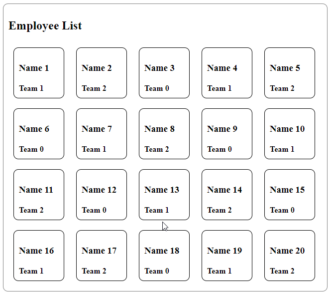
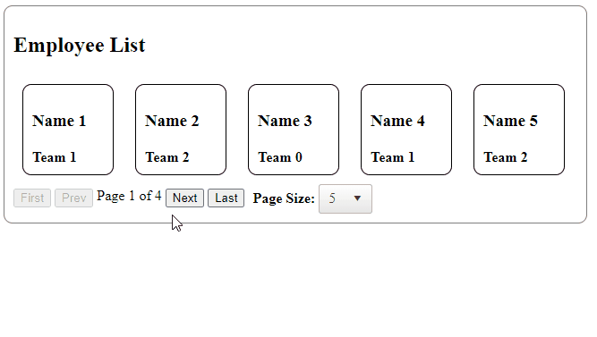
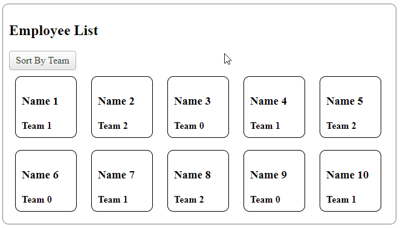
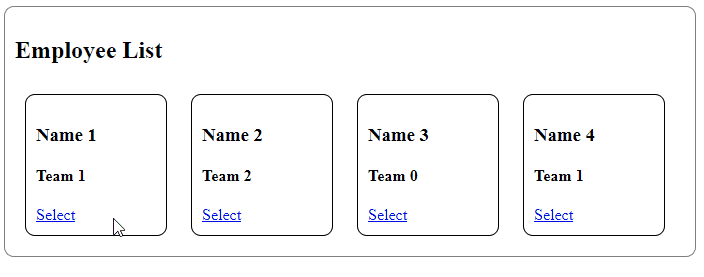
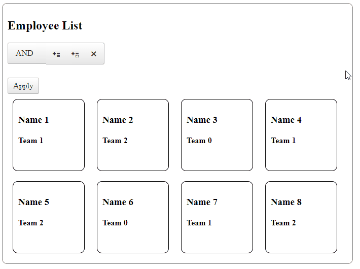
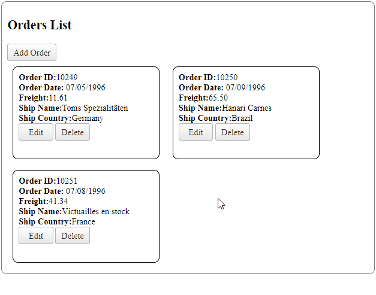

# ListView Overview


Telerik RadListView is designed to give your the freedom to specify predefined or customized type of layout for the items displayed in the control and in the same time gives you integrated sorting, paging, grouping, editing, selecting, etc. capabilities. You can embed various controls of your choice in RadListView's templates and model their appearance in a custom manner. Thanks to its innovative architecture Telerik RadListView is extremely fast and generates very little output. Added to this is true cross browser support  — all major/modern browsers, see [Browser Support - Telerik UI for ASP.NET AJAX](https://www.telerik.com/aspnet-ajax/tech-sheets/browser-support)

To test it by your own and see its benefits in practice you can start a free trial using the button below


>caption To create a basic `RadListView`:

1. ensure you have a script manager on the page (use \<asp:ScriptManager> tag to declare one)
1. use the \<telerik:RadListView> tag to declare the ListView and to set its global properties
1. use its `DataSource` (or `DataSourceID`) property to reference the variable (or the DataSource component) that will hold your collection of data, see [Telerik RadListView Data Binding section in our documentation]()
1. define the Layout Template and declare ItemPlaceholder control inside which will contain the Items collection
1. define the Item Template and set desired styles


````ASPX
<asp:ScriptManager ID="ScriptManager1" runat="server"></asp:ScriptManager>

<telerik:RadListView ID="RadListView1" runat="server" OnNeedDataSource="RadListView1_NeedDataSource" ItemPlaceholderID="PlaceHolder1">
    <LayoutTemplate>
        <div class="listview-layout">
            <h2>Employee List</h2>

            <asp:PlaceHolder ID="PlaceHolder1" runat="server"></asp:PlaceHolder>
        </div>
    </LayoutTemplate>
    <ItemTemplate>
        <div class="listview-item">
            <h3><%# Eval("Name") %></h3>
            <h4><%# Eval("Team") %></h4>
        </div>
    </ItemTemplate>
</telerik:RadListView>
````
````CSS
.listview-layout {
    width: 630px;
    border: 1px solid gray;
    border-radius: 10px;
    padding: 10px;
}

.listview-item {
    height: 80px;
    width: 80px;
    display: inline-block;
    margin: 10px;
    border: 1px solid black;
    border-radius: 10px;
    padding: 10px;
}
````

Code-behind:

````C#
protected void RadListView1_NeedDataSource(object sender, RadListViewNeedDataSourceEventArgs e)
{
    RadListView1.DataSource = ListViewData;
}
List<SampleData> ListViewData = Enumerable.Range(1, 20).Select(x => new SampleData
{
    Id = x,
    Name = "Name " + x,
    Team = "Team " + x % 3
}).ToList();

public class SampleData
{
    public int Id { get; set; }
    public string Name { get; set; }
    public string Team { get; set; }
}
````
````VB
 Protected Sub RadListView1_NeedDataSource(ByVal sender As Object, ByVal e As RadListViewNeedDataSourceEventArgs)
        RadListView1.DataSource = ListViewData
    End Sub

    Private ListViewData As List(Of SampleData) = Enumerable.Range(1, 20).[Select](Function(x) New SampleData With {
        .Id = x,
        .Name = "Name " & x,
        .Team = "Team " & x Mod 3
    }).ToList()

    Public Class SampleData
        Public Property Id As Integer
        Public Property Name As String
        Public Property Team As String
    End Class
````

The result from the code above:




Enable paging:
- Set AllowPaging="true" and define the PageSize
- Add pager declaration to the layout template


````ASPX
<telerik:RadListView ID="RadListView1" runat="server" OnNeedDataSource="RadListView1_NeedDataSource" ItemPlaceholderID="PlaceHolder1" AllowPaging="true" PageSize="5">
    <LayoutTemplate>
        <div class="listview-layout">
            <h1>Employee List</h1>

            <asp:PlaceHolder ID="PlaceHolder1" runat="server"></asp:PlaceHolder>

            <div>
                <div style="float: left; margin-left: 30%;">
                    <asp:Button runat="server" ID="btnFirst" CommandName="Page" CommandArgument="First"
                        Text="First" Enabled="<%#Container.CurrentPageIndex > 0 %>" />
                    <asp:Button runat="server" ID="btnPrev" CommandName="Page" CommandArgument="Prev"
                        Text="Prev" Enabled="<%#Container.CurrentPageIndex > 0 %>" />
                    <span style="vertical-align: top; position: relative; top: 4px">Page <%#Container.CurrentPageIndex + 1 %> of<%#Container.PageCount %></span>
                    <asp:Button runat="server" ID="btnNext" CommandName="Page" CommandArgument="Next"
                        Text="Next" Enabled="<%#Container.CurrentPageIndex + 1 < Container.PageCount %>" />
                    <asp:Button runat="server" ID="btnLast" CommandName="Page" CommandArgument="Last"
                        Text="Last" Enabled="<%#Container.CurrentPageIndex + 1 < Container.PageCount %>" />
                </div>
                <div>
                    <span style="vertical-align: middle; font-weight: bold; padding-left: 5px;">Page Size:</span>
                    <telerik:RadComboBox RenderMode="Lightweight" runat="server" ID="cmbPageSize" OnSelectedIndexChanged="cmbPageSize_SelectedIndexChanged"
                        AutoPostBack="true" Width="40px" SelectedValue="<%#Container.PageSize %>">
                        <Items>
                            <telerik:RadComboBoxItem Text="5" Value="5" />
                            <telerik:RadComboBoxItem Text="10" Value="10" />
                            <telerik:RadComboBoxItem Text="15" Value="15" />
                            <telerik:RadComboBoxItem Text="20" Value="20" />
                        </Items>
                    </telerik:RadComboBox>
                </div>
            </div>
        </div>
    </LayoutTemplate>
    <ItemTemplate>...</ItemTemplate>
</telerik:RadListView>
````

Code-behind:

````C#
protected void cmbPageSize_SelectedIndexChanged(object sender, RadComboBoxSelectedIndexChangedEventArgs e)
{
    var rlv = (sender as RadComboBox).NamingContainer as RadListView;
    rlv.PageSize = Int32.Parse(e.Value);
    rlv.Rebind();
}
````
````VB
Protected Sub cmbPageSize_SelectedIndexChanged(ByVal sender As Object, ByVal e As RadComboBoxSelectedIndexChangedEventArgs)
    Dim rlv = TryCast((TryCast(sender, RadComboBox)).NamingContainer, RadListView)
    rlv.PageSize = Int32.Parse(e.Value)
    rlv.Rebind()
End Sub
````

Result from code snippets above:



Main benefits of using RadListView:

* **Accessibility Compliance**
    - [Accessibility support](https://www.telerik.com/aspnet-ajax/tech-sheets/accessibility-support)

* **Various templates for data and layout presentation, edit or insert operations, selection, grouping etc.**
    - [Data and Layout Templates]()
    - [Edit and Insert Templates]()

* **Set of commonly used predefined layouts and unlimited possibilities for custom layouts definitions**
    - [Predifined Layouts]()
    - [Custom Layouts]()

* **DataBinding capabilities**
    - [Server-side Binding](%slug listview/data-binding/server-side/simple-vs-advanced%)
    - [Client-side Binding](%slug listview/data-binding/client-side/overview%)


**List of key features you can find below:**
- [Sorting](%slug listview/fuctionality/sorting/overview%)
- [Paging](%slug listview/fuctionality/paging/integrated-paging%)
- [Selecting](%slug listview/fuctionality/selecting/items%)
- [Grouping](%slug listview/fuctionality/grouping/overview%)
- [Filtering](%slug listview/fuctionality/filtering/overview%)
- [Create/Read/Update/Delete (CRUD) operations](%slug listview/data-editing/automatic-crud-operations%)
- [Skins](%slug listview/appearance-and-styling/skins%)
- [Edit form Validation](%slug listview/data-editing/flexible-validation%)


>caption First steps on enabling functionalities: 

* Enable sorting    

````ASPX
<telerik:RadButton ID="RadButton1" runat="server" Text="Sort By Team" OnClick="RadButton1_Click"></telerik:RadButton>
````
````C#
protected void RadButton1_Click(object sender, EventArgs e)
{
    RadListViewSortExpression expression = new RadListViewSortExpression();
    RadListView1.SortExpressions.Clear();
    expression.FieldName = "Team";
    expression.SortOrder = RadListViewSortOrder.Ascending;
    RadListView1.SortExpressions.AddSortExpression(expression);
    RadListView1.Rebind();
}
````
````VB
Protected Sub RadButton1_Click(ByVal sender As Object, ByVal e As EventArgs)
    Dim expression As RadListViewSortExpression = New RadListViewSortExpression()
    RadListView1.SortExpressions.Clear()
    expression.FieldName = "Team"
    expression.SortOrder = RadListViewSortOrder.Ascending
    RadListView1.SortExpressions.AddSortExpression(expression)
    RadListView1.Rebind()
End Sub
````



* Enable selection

````ASPX
<telerik:RadListView ID="RadListView1" runat="server" OnNeedDataSource="RadListView1_NeedDataSource" ItemPlaceholderID="PlaceHolder1" AllowMultiItemSelection="true">
    <LayoutTemplate>
        <div class="listview-layout">
            <h2>Employee List</h2>
            <asp:PlaceHolder ID="PlaceHolder1" runat="server"></asp:PlaceHolder>
        </div>
    </LayoutTemplate>
    <ItemTemplate>
        <div class="listview-item">
            <h3><%# Eval("Name") %></h3>
            <h4><%# Eval("Team") %></h4>
            <asp:LinkButton ID="SelectButton1" Text="Select" CommandName="Select" runat="server" />
        </div>
    </ItemTemplate>
    <SelectedItemTemplate>
        <div class="listview-item SelectedItem">
            <h3><%# Eval("Name") %></h3>
            <h4><%# Eval("Team") %></h4>
            <asp:LinkButton ID="DeselectButton1" Text="Deselect" CommandName="Deselect" runat="server" />
        </div>
    </SelectedItemTemplate>
</telerik:RadListView>
````
````CSS
.listview-item.SelectedItem {
    background-color: lightblue;
}
````



* Enable filtering

Sample grouping with RadFilter, see [RadFilter - Telerik ASP.NET Filter](https://demos.telerik.com/aspnet-ajax/filter/examples/overview/defaultcs.aspx)

````ASPX
<telerik:RadListView ID="RadListView1" runat="server" OnNeedDataSource="RadListView1_NeedDataSource" ItemPlaceholderID="PlaceHolder1">
    <LayoutTemplate>
        <div class="listview-layout">
            <h2>Employee List</h2>

            <telerik:RadFilter RenderMode="Lightweight" runat="server" ID="RadFilter1" FilterContainerID="RadListView1"></telerik:RadFilter>

            <asp:PlaceHolder ID="PlaceHolder1" runat="server"></asp:PlaceHolder>
        </div>
    </LayoutTemplate>
    <ItemTemplate>
        <div class="listview-item">
            <h3><%# Eval("Name") %></h3>
            <h4><%# Eval("Team") %></h4>
        </div>
    </ItemTemplate>
</telerik:RadListView>
````



* Create/Read/Update/Delete (CRUD) operations and validation

Sample Automatic CRUD operations with ListView bound to SqlDataSource component:

````ASPX
<telerik:RadListView ID="RadListView1" runat="server" DataKeyNames="OrderID" InsertItemPosition="FirstItem"
    DataSourceID="SqlDataSource1" ItemPlaceholderID="PlaceHolder1">
    <ValidationSettings EnableValidation="true" />
    <LayoutTemplate>
        <div class="listview-layout">
            <h2>Orders List</h2>
            <telerik:RadButton ID="RadButton1" runat="server" Text="Add Order" CommandName="InitInsert"></telerik:RadButton>
            <br />
            <asp:PlaceHolder ID="PlaceHolder1" runat="server"></asp:PlaceHolder>

        </div>
    </LayoutTemplate>
    <ItemTemplate>
        <div class="listview-item">
            <b>Order ID:</b><%# Eval("OrderID") %>
            <br />
            <b>Order Date:</b> <%# String.Format("{0:MM/dd/yyyy}",Eval("OrderDate")) %>
            <br />
            <b>Freight:</b><%# Eval("Freight") %>
            <br />
            <b>Ship Name:</b><%# Eval("ShipName") %>
            <br />
            <b>Ship Country:</b><%# Eval("ShipCountry") %>
            <br />
            <telerik:RadButton ID="RadButton2" runat="server" Text="Edit" CommandName="Edit"></telerik:RadButton>
            <telerik:RadButton ID="RadButton5" runat="server" Text="Delete" CommandName="Delete"></telerik:RadButton>
        </div>
    </ItemTemplate>
    <EditItemTemplate>
        <div class="listview-item editform">
            </br> <b>Order Date:</b><telerik:RadDatePicker ID="RadDatePicker1" runat="server" DbSelectedDate='<%# Bind("OrderDate") %>'></telerik:RadDatePicker>
            </br> <b>Freight:</b><telerik:RadTextBox ID="RadTextBox1" runat="server" Text='<%# Bind("Freight") %>'></telerik:RadTextBox>
            </br> <b>Ship Name:</b><telerik:RadTextBox ID="RadTextBox2" runat="server" Text='<%# Bind("ShipName") %>'></telerik:RadTextBox>
            </br> <b>Ship Country:</b><telerik:RadTextBox ID="RadTextBox3" runat="server" Text='<%# Bind("ShipCountry") %>'></telerik:RadTextBox>
            <br />
            <telerik:RadButton ID="RadButton3" runat="server" Text="Update" CommandName="Update"></telerik:RadButton>
            <telerik:RadButton ID="RadButton4" runat="server" Text="Cancel" CommandName="Cancel"></telerik:RadButton>
        </div>
    </EditItemTemplate>
    <InsertItemTemplate>
        <div class="listview-item insertform">
            </br> <b>Order Date:</b><telerik:RadDatePicker ID="RadDatePicker1" runat="server" DbSelectedDate='<%# Bind("OrderDate") %>'></telerik:RadDatePicker>
            </br> <b>Freight:</b><telerik:RadTextBox ID="RadTextBox1" runat="server" Text='<%# Bind("Freight") %>'></telerik:RadTextBox>
            </br> <b>Ship Name:</b><telerik:RadTextBox ID="RadTextBox2" runat="server" Text='<%# Bind("ShipName") %>'></telerik:RadTextBox>
            <asp:RequiredFieldValidator ID="RequiredFieldValidator1" runat="server" ControlToValidate="RadTextBox2" ErrorMessage="Required Field"></asp:RequiredFieldValidator>
            </br> <b>Ship Country:</b><telerik:RadTextBox ID="RadTextBox3" runat="server" Text='<%# Bind("ShipCountry") %>'></telerik:RadTextBox>
            <asp:RequiredFieldValidator ID="RequiredFieldValidator2" runat="server" ControlToValidate="RadTextBox3" ErrorMessage="Required Field"></asp:RequiredFieldValidator>

            <br />
            <telerik:RadButton ID="RadButton3" runat="server" Text="Insert" CommandName="PerformInsert"></telerik:RadButton>
            <telerik:RadButton ID="RadButton4" runat="server" Text="Cancel" CommandName="Cancel"></telerik:RadButton>
        </div>
    </InsertItemTemplate>
</telerik:RadListView>

<asp:SqlDataSource ID="SqlDataSource1" runat="server"
    ConnectionString="<%$ ConnectionStrings:NorthwindConnectionString %>"
    InsertCommand="INSERT INTO [Orders] ([OrderDate], [Freight], [ShipName], [ShipCountry]) VALUES (@OrderDate, @Freight, @ShipName, @ShipCountry)"
    SelectCommand="SELECT [OrderID], [OrderDate], [Freight], [ShipName], [ShipCountry] FROM [Orders]"
    UpdateCommand="UPDATE [Orders] SET [OrderDate] = @OrderDate, [Freight] = @Freight, [ShipName] = @ShipName, [ShipCountry] = @ShipCountry  WHERE [OrderID] = @OrderID"
    DeleteCommand="DELETE FROM [Orders] WHERE [OrderID] = @OrderID"></asp:SqlDataSource>
````
````CSS
.listview-layout {
    width: 670px;
    border: 1px solid gray;
    border-radius: 10px;
    padding: 10px;
}

.listview-item {
    height: 150px;
    width: 250px;
    display: inline-block;
    margin: 10px;
    border: 1px solid black;
    border-radius: 10px;
    padding: 10px;
}

.listview-item.editform,
.listview-item.insertform {
    height: 200px;
    width: 400px;
}
````



## See Also

- [Getting Started]()
- [Live Demos](https://demos.telerik.com/aspnet-ajax/listview/examples/overview/defaultcs.aspx)


