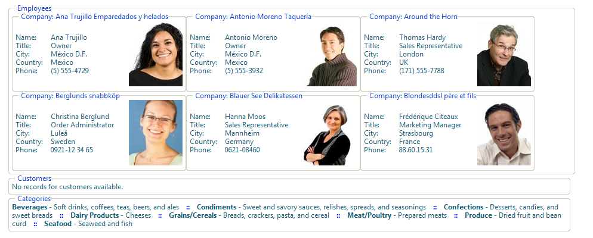

# Data and Layout


## 

RadListView for ASP.NET AJAX exposes a variety of templates that can used to model the look and feel of its source data and layout. This topic covers the data and layout templates of the product.

The most general template of RadListView is its LayoutTemplate. It specifies the overall appearance of the control, the outer wrapper that will be used for the listview rendering as well as the holder of its content. This is defined between the LayoutTemplate tag of RadListView, for example:

````ASP.NET
<telerik:RadListView ID="RadListView1" DataSourceID="SqlDataSource1" runat="server"
    ItemPlaceholderID="EmployeesContainer">
    <LayoutTemplate>
        <fieldset>
            <legend>Employees</legend>
            <asp:PlaceHolder ID="EmployeesContainer" runat="server" />
        </fieldset>
    </LayoutTemplate>
</telerik:RadListView>
````


>note Note that you have to specify **ItemPlaceholderID** property value for RadListView that matches the id of an ASP.NET server control (with id and runat=server properties set) which will be used as a holder of the actual listview data content. In the above code snippet this is **asp PlaceHolder** with id **EmployeesContainer** .
>


Other commonly used templates are the ItemTemplate/AlternatingItemTemplate. They mark out how the data that is bound to the listview will be visualized in its odd/even items respectively. Since those are templates, you are free to customize their layout according to your custom conventions. Below is a sample definition of ItemTemplate/AlternatingItemTemplate which have fields and tables along with DataBoundLiteralControls and images in their cells:

````ASP.NET
<telerik:RadListView ID="RadListView2" DataSourceID="SqlDataSource1" runat="server"
    ItemPlaceholderID="EmployeesContainer">
    <ItemTemplate>
        <fieldset style="float: left; width: 280px;">
            <legend>Company:<%# Eval( "CompanyName" ) %>
            </legend>
            <table cellpadding="0" cellspacing="0">
                <tr>
                    <td>
                        <table cellpadding="0" cellspacing="0">
                            <tr>
                                <td style="width: 25%">
                                    Name:
                                </td>
                                <td style="width: 50%">
                                    <%# Eval("ContactName")%>
                                </td>
                            </tr>
                            <tr>
                                <td>
                                    Title:
                                </td>
                                <td>
                                    <%# Eval("ContactTitle")%>
                                </td>
                            </tr>
                            <tr>
                                <td>
                                    City:
                                </td>
                                <td>
                                    <%# Eval("City")%>
                                </td>
                            </tr>
                            <tr>
                                <td>
                                    Country:
                                </td>
                                <td>
                                    <%# Eval("Country")%>
                                </td>
                            </tr>
                            <tr>
                                <td>
                                    Phone:
                                </td>
                                <td>
                                    <%#Eval("Phone")%>
                                </td>
                            </tr>
                        </table>
                    </td>
                    <td align="right" style="width: 25%; padding-left: 10px;">
                        <telerik:RadBinaryImage ID="RadBinaryImage1" runat="server" AlternateText="Contact Photo"
                            ToolTip="Contact Photo" Width="90px" Height="110px" ResizeMode="Fit" DataValue='<%# Eval("Photo") %>' />
                    </td>
                </tr>
            </table>
        </fieldset>
    </ItemTemplate>
    <AlternatingItemTemplate>
        <fieldset style="float: left; width: 280px;">
            <legend>Company:
                <%#Eval("CompanyName")%>
            </legend>
            <table cellpadding="0" cellspacing="0">
                <tr>
                    <td>
                        <table cellpadding="0" cellspacing="0">
                            <tr>
                                <td style="width: 25%">
                                    Name:
                                </td>
                                <td style="width: 50%;">
                                    <%#Eval("ContactName")%>
                                </td>
                            </tr>
                            <tr>
                                <td>
                                    Title:
                                </td>
                                <td>
                                    <%#Eval("ContactTitle")%>
                                </td>
                            </tr>
                            <tr>
                                <td>
                                    City:
                                </td>
                                <td>
                                    <%# Eval("City")%>
                                </td>
                            </tr>
                            <tr>
                                <td>
                                    Country:
                                </td>
                                <td>
                                    <%# Eval("Country")%>
                                </td>
                            </tr>
                            <tr>
                                <td>
                                    Phone:
                                </td>
                                <td>
                                    <%#Eval("Phone")%>
                                </td>
                            </tr>
                        </table>
                    </td>
                    <td align="right" style="width: 25%; padding-left: 10px;">
                        <telerik:RadBinaryImage ID="RadBinaryImage1" runat="server" AlternateText="Contact Photo"
                            ToolTip="Contact Photo" Width="90px" Height="110px" ResizeMode="Fit" DataValue='<%# Eval("Photo") %>' />
                    </td>
                </tr>
            </table>
        </fieldset>
    </AlternatingItemTemplate>
</telerik:RadListView>
````


Other useful templates are RadListView's EmptyDataTemplate and ItemSeparatorTemplate. The first represents what will be shown in the control when it is bound to an empty data source while the second outlines the separator that will be displayed between the listview items. Here a couple of usages of these templates:

````ASP.NET
<telerik:RadListView ID="RadListView4" DataSourceID="SqlDataSource1" runat="server"
    ItemPlaceholderID="EmployeesContainer">
    <EmptyDataTemplate>
        <fieldset style="width: 930px">
            <legend>Customers</legend>No records for customers available.
        </fieldset>
    </EmptyDataTemplate>
</telerik:RadListView>
````


````ASP.NET
<telerik:RadListView ID="RadListView3" DataSourceID="SqlDataSource1" runat="server"
    ItemPlaceholderID="EmployeesContainer">
    <ItemSeparatorTemplate>
        <span style="color: Blue; font-weight: bold;">   ::   </span>
    </ItemSeparatorTemplate>
</telerik:RadListView>
````


All these templates are employed on [this online demo](https://demos.telerik.com/aspnet-ajax/listview/examples/templates/datalayouttemplates/defaultcs.aspx) of the product.

Refer to the code implementation in it for more details.

Keep in mind that you need to specify ItemPlaceholderID property value for RadListView that matches the id of an ASP.NET server control (with id and runat=server properties set) which will be used as a holder of the actual listview data content. The three RadListView instances on the example have asp PlaceHolder and asp Panels defined inside their LayoutTemplates for this purpose.
