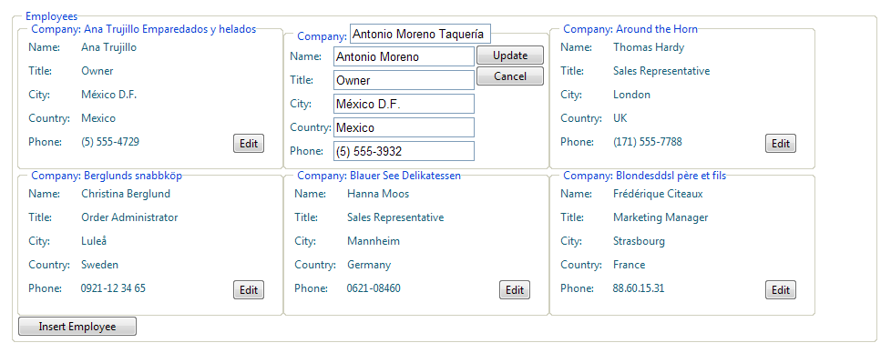

# Edit and Insert


## 

RadListView for ASP.NET AJAX exposes a variety of templates that can used to model the look and feel of its source data and layout. This topic covers the edit and insert templates of the product.

The **EditItemTemplate** and **InsertItemTemplate** of RadListView determine what controls will be rendered to allow end user input when you edit listview item or show the insertion form of the control. Since those are templates, you are free to customize their layout according to your custom conventions. We recommend synchronizing the editors with the data type of the underlying source field and using validation for the user entries. Below is a sample definition of EditItemTemplate/InsertItemTemplate which have fields and tables along with asp TextBoxes and RequiredFieldValidators in their cells:

````ASP.NET
<telerik:RadListView runat="server" ID="RadListView1">
    <EditItemTemplate>
        <fieldset style="float: left; width: 280px; height: 155px">
            <legend>Company:
                <asp:TextBox ID="txtBoxCompany" runat="server" Text='<%#Bind("CompanyName")%>' />
                <asp:RequiredFieldValidator ID="rvCompany" runat="server" ControlToValidate="txtBoxCompany"
                    ErrorMessage="Please enter company" Display="Dynamic" />
            </legend>
            <table cellpadding="0" cellspacing="0" width="95%">
                <tr>
                    <td style="width: 75%">
                        <table cellpadding="1" cellspacing="0">
                            <tr>
                                <td style="width: 25%">
                                    Name:
                                </td>
                                <td style="width: 75%">
                                    <asp:TextBox ID="txtBoxName" runat="server" Text='<%#Bind("ContactName")%>' />
                                    <asp:RequiredFieldValidator ID="rvName" runat="server" ControlToValidate="txtBoxName"
                                        ErrorMessage="Please enter name" Display="Dynamic" />
                                </td>
                            </tr>
                            <tr>
                                <td>
                                    Title:
                                </td>
                                <td>
                                    <asp:TextBox ID="txtBoxTitle" runat="server" Text='<%#Bind("ContactTitle")%>' />
                                    <asp:RequiredFieldValidator ID="rvTitle" runat="server" ControlToValidate="txtBoxTitle"
                                        ErrorMessage="Please enter title" Display="Dynamic" />
                                </td>
                            </tr>
                            <tr>
                                <td>
                                    City:
                                </td>
                                <td>
                                    <asp:TextBox ID="txtBoxCity" runat="server" Text='<%#Bind("City")%>' />
                                    <asp:RequiredFieldValidator ID="rvCity" runat="server" ControlToValidate="txtBoxCity"
                                        ErrorMessage="Please enter city" Display="Dynamic" />
                                </td>
                            </tr>
                            <tr>
                                <td>
                                    Country:
                                </td>
                                <td>
                                    <asp:TextBox ID="txtBoxCountry" runat="server" Text='<%#Bind("Country")%>' />
                                    <asp:RequiredFieldValidator ID="rvCountry" runat="server" ControlToValidate="txtBoxCountry"
                                        ErrorMessage="Please enter country" Display="Dynamic" />
                                </td>
                            </tr>
                            <tr>
                                <td>
                                    Phone:
                                </td>
                                <td>
                                    <asp:TextBox ID="txtBoxPhone" runat="server" Text='<%#Bind("Phone")%>' />
                                    <asp:RequiredFieldValidator ID="rvPhone" runat="server" ControlToValidate="txtBoxPhone"
                                        ErrorMessage="Please enter phone" Display="Dynamic" />
                                </td>
                            </tr>
                        </table>
                    </td>
                    <td style="vertical-align: top; text-align: right; width: 25%;">
                        <asp:Button ID="btnUpdate" runat="server" Text="Update" CommandName="Update" Width="70px" />
                        <asp:Button ID="BtnCancel" runat="server" Text="Cancel" CommandName="Cancel" CausesValidation="false"
                            Width="70px" />
                    </td>
                </tr>
            </table>
        </fieldset>
    </EditItemTemplate>
    <InsertItemTemplate>
        <fieldset style="float: left; width: 280px; height: 160px;">
            <legend>Company:
                <asp:TextBox ID="txtBoxCompany" runat="server" />
                <asp:RequiredFieldValidator ID="rvCompany" runat="server" ControlToValidate="txtBoxCompany"
                    ErrorMessage="Please enter company" Display="Dynamic" />
            </legend>
            <table cellpadding="0" cellspacing="0" width="95%">
                <tr>
                    <td style="width: 75%">
                        <table cellpadding="1" cellspacing="0">
                            <tr>
                                <td style="width: 25%">
                                    Name:
                                </td>
                                <td style="width: 75%">
                                    <asp:TextBox ID="txtBoxName" runat="server" Text='<%# Bind("CompanyName") %>' />
                                    <asp:RequiredFieldValidator ID="rvName" runat="server" ControlToValidate="txtBoxName"
                                        ErrorMessage="Please enter name" Display="Dynamic" />
                                </td>
                            </tr>
                            <tr>
                                <td>
                                    Title:
                                </td>
                                <td>
                                    <asp:TextBox ID="txtBoxTitle" runat="server" Text='<%# Bind("ContactTitle") %>' />
                                    <asp:RequiredFieldValidator ID="rvTitle" runat="server" ControlToValidate="txtBoxTitle"
                                        ErrorMessage="Please enter title" Display="Dynamic" />
                                </td>
                            </tr>
                            <tr>
                                <td>
                                    City:
                                </td>
                                <td>
                                    <asp:TextBox ID="txtBoxCity" runat="server" Text='<%# Bind("City") %>' />
                                    <asp:RequiredFieldValidator ID="rvCity" runat="server" ControlToValidate="txtBoxCity"
                                        ErrorMessage="Please enter city" Display="Dynamic" />
                                </td>
                            </tr>
                            <tr>
                                <td>
                                    Country:
                                </td>
                                <td>
                                    <asp:TextBox ID="txtBoxCountry" runat="server" Text='<%# Bind("Country") %>' />
                                    <asp:RequiredFieldValidator ID="rvCountry" runat="server" ControlToValidate="txtBoxCountry"
                                        ErrorMessage="Please enter country" Display="Dynamic" />
                                </td>
                            </tr>
                            <tr>
                                <td>
                                    Phone:
                                </td>
                                <td>
                                    <asp:TextBox ID="txtBoxPhone" runat="server" Text='<%# Bind("Phone") %>' />
                                    <asp:RequiredFieldValidator ID="rvPhone" runat="server" ControlToValidate="txtBoxPhone"
                                        ErrorMessage="Please enter phone" Display="Dynamic" />
                                </td>
                            </tr>
                        </table>
                    </td>
                    <td style="vertical-align: top; text-align: right; width: 25%;">
                        <asp:Button ID="btnPerformInsert" runat="server" Text="Insert" CommandName="PerformInsert"
                            Width="70px" />
                        <asp:Button ID="BtnCancel" runat="server" Text="Cancel" CommandName="Cancel" CausesValidation="false"
                            Width="70px" />
                    </td>
                </tr>
            </table>
        </fieldset>
    </InsertItemTemplate>
</telerik:RadListView>
````


[This example](http://demos.telerik.com/aspnet-ajax/listview/examples/templates/editinserttemplates/defaultcs.aspx) demonstrates the usage of edit and insert templates in RadListView for ASP.NET AJAX.


Refer to the code implementation in it for more details.

>tip Keep in mind that you need to specify ItemPlaceholderID property value for RadListView which matches the id of an ASP.NET server control (with id and runat=server properties set) which will be used as a holder of the actual listview data content. The RadListView instance on the example has asp PlaceHolder defined inside its LayoutTemplates for this purpose.
>
