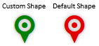
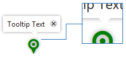

# Customizing Markers in RadMap


This article explains how to customize the appearance of the [Markers]() on __RadMap__.

You can quickly navigate through the sections in this list:

1. [Marker as a DOM Element	](#marker-as-a-dom-element)—explains how a Marker is rendered so you can know how to modify it.

1. [Change Marker’s Color and Size	](#change-marker’s-color-and-size)—the basic scenario where you only need to change the color and, optionally, the size.

1. [Change Marker’s Image](#change-marker’s-image)—replace the marker icon with a custom image.

1. [Fine-tune Tooltip’s and Marker’s Positions	](#fine-tune-tooltip’s-and-marker’s-positions)—handling side effects from the customization

1. [Fine-tune the Tooltip Appearance	](#1.-fine-tune-the-tooltip-appearance)

1. [Fine-tune the Marker’s Position	](#2.-fine-tune-the-marker’s-position)

## Marker as a DOM Element

__RadMap__’s __Marker__, as part of the HTML page, is rendered as a plain `	<span>`tag. By design, the __Shape__ property defines the look of the __Marker__.Behind the scenes, this is achieved just by modifying the default class name of the `	<span>` tag.

For example, a __Shape__ property with value __myCustomShape__ or __my-custom-shape__will render this __Marker__ element - `	<span class="k-marker k-marker-my-custom-shape"></span>`. As you can see, values with camelCase style are converted to words separated with dashes.

Later, this class can be used to specify the look of the __Marker__ using a CSS rule.

__Example 1__: Setting the Shape property to a custom value

````ASPNET
		<telerik:RadMap runat="server" ID="RadMap1">
			<MarkersCollection>
				<telerik:MapMarker Shape="myCustomShape"></telerik:MapMarker>
				<telerik:MapMarker Shape="my-custom-shape"></telerik:MapMarker>
			</MarkersCollection>
		</telerik:RadMap>
````


## Change Marker’s Color and Size

This is the most basic scenario and it is the easiest one to implement. With the informationfrom the [Marker as a DOM Element](#marker-as-a-dom-element) section, you can see how a __Marker__can be identified in the DOM,in order to be targeted by a CSS selector.

It is important to note that, by default, __Marker__ icons are rendered via __glyph icons__ under modern browsers,and fall back to plain images when glyph icons are not supported by the browser. The solution here worksonly for modern browsers where __glyph icons__ are supported. If you need a solution for IE versions prior toIE9, see the [Change Marker’s Image](#change-marker’s-image) section.

In order to change the marker color, you will need to decorate the __:before__ pseudo element of the __Marker__’s span tag.
>caption Figure 1: The result from the code in Example 2.



__Example 2__: Setting a custom color to a marker.

````ASPNET
			<style type="text/css">
				.RadMap .k-marker.k-marker-my-custom-shape:before {
					color: green;
				}
			</style>
	
			<telerik:RadMap runat="server" ID="RadMap1" Zoom="1">
				<MarkersCollection>
					<telerik:MapMarker Shape="myCustomShape">
						<LocationSettings Latitude="0" Longitude="0"/>
					</telerik:MapMarker>
					<telerik:MapMarker Shape="pinTarget">
						<LocationSettings Latitude="0" Longitude="50"/>
					</telerik:MapMarker>
				</MarkersCollection>
			</telerik:RadMap>
	
````


Optionally, you can also change the marker size (__Figure 2__) by changing the font-sizevalue of the __:before__ pseudo element (__Example 3__).

>note Changing the marker’s size will always cause the marker to be	rendered at an incorrect position according the longitude and latitude	values. The[Fine-tune Marker’s and Tooltip’s Position](#fine-tune-tooltip’s-and-marker’s-positions)section explains	how to handle this situation.
>

>caption Figure 2: Reduced Marker’s size using the CSS from Example 3


__Example 3__: Using the font-size CSS property to change the size of the Marker’s pseudo element.

````VB
				.RadMap .k-marker.k-marker-my-custom-shape:before {
					color: green;
					font-size:25px;
				}
````


## Change Marker’s Image

In order to replace the __Marker__’s glyph icon with an actual image, you should first reset the__:before__ pseudo element’s decoration, and use the CSS selector to apply the styles needed to show the image.

>note In order to apply the image, the __Marker__ ’s span element should be resized.	This will break the position of the marker. To fix that, see the[Fine-tune Marker’s and Tooltip’s Position](#fine-tune-tooltip’s-and-marker’s-positions)section.
>


__Example 4__: Replacing the glyph icon with an image.

````ASPNET
			<style type="text/css">
				.RadMap .k-marker.k-marker-my-custom-shape:before {
					content:none;
					font-size:0;
					margin:0;
					padding:0;
					height:0;
					width:0;
				}
	
				.RadMap .k-marker.k-marker-my-custom-shape {
					background-image:url('[Path-to-Image]');
					background-repeat:no-repeat;
					background-position: 0 0;   
					width:[Image-Width];
					height:[Image-Height];         
				}
			</style>
			
			<telerik:RadMap runat="server" ID="RadMap1" Zoom="1">
				<MarkersCollection>
					<telerik:MapMarker Shape="myCustomShape">
						<LocationSettings Latitude="0" Longitude="0" />
					</telerik:MapMarker>
					<telerik:MapMarker Shape="pinTarget">
						<LocationSettings Latitude="0" Longitude="50" />
					</telerik:MapMarker>
				</MarkersCollection>
			</telerik:RadMap>
````


## Fine-tune Tooltip’s and Marker’s Positions

Changing the size of the __Marker__element will always lead to incorrect position of the markeritself and its tooltip. You can see __Figure 3__ and __Figure 4__.

__Figure 3__ showcases the wrong tooltip appearance after changing the marker size(__Example 3__) in [Change Marker’s Color and Size](#change-marker’s-color-and-size).You can fix that by following the instructions in [Fine-tune the Tooltip Appearance](#fine-tune-tooltip’s-and-marker’s-positions) section.
>caption Figure 3: Incorrect tooltip appearance for a resized marker—callout is not aligned to the marker.



In __Figure 4__, you can see the wrong __Marker__’s position,showcased by using two markers—a custom one and a default one.They are placed at the same geographic location, but the custom __Marker__’s position is incorrect.You can fix that by following the instructions in [Fine-tune the Marker’s Position](#2.-fine-tune-the-marker’s-position) section
>caption Figure 4: Incorrect Marker’s position for a resized marker


The list below explains the sections that you need to follow based on the situation.

* When the Marker’s icon size is changed:

1. [	Fine-tune the Tooltip Appearance](#1.-fine-tune-the-tooltip-appearance)

1. [	Fine-tune the Marker’s Position](#2.-fine-tune-the-marker’s-position)

* When the Marker’s icon is replaced with a custom image:

1. [	Fine-tune the Marker’s Position](#2.-fine-tune-the-marker’s-position)

### 1. Fine-tune the Tooltip Appearance

To make sure the tooltip looks as expected when its marker size is changed,you should set the same height to the :before pseudo element and to the marker’s spanelement. Afterwards, you should modify the left and top margins of the :before pseudoelement to align the glyph icon according to the marker’s element.
>caption Figure 5: Using the CSS from Example 5 to fine-tune the tooltip.


__Example 5__: Fine-tuning the tooltip’s appearance.

````ASPNET
			<style type="text/css">
				.RadMap .k-marker.k-marker-my-custom-shape:before {
					color: green;
					font-size: 25px;
					margin-left: -19px;
					margin-top: -9px;
				}
	
				.RadMap .k-marker.k-marker-my-custom-shape {
					height: 25px;
				}
			</style>
	
			<telerik:RadMap runat="server" ID="RadMap1" Zoom="1">
				<MarkersCollection>
					<telerik:MapMarker Shape="myCustomShape" Title="Tooltip Text">
						<LocationSettings Latitude="0" Longitude="0" />
						<TooltipSettings AutoHide="false"></TooltipSettings>
					</telerik:MapMarker>
				</MarkersCollection>
			</telerik:RadMap>
````


### 2. Fine-tune the Marker’s Position

After changing the height of the span element rendered by the __Marker__,in order to fine-tune the marker’s position, you should fine-tune the markerelement’s top and left margins. The values that lead to the proper layout depend	on the differences between the original and the custom size used.

>tip : Use two Marker items—a default one and a custom one, set to the same coordinate position. This will help you to properly fine-tune the Marker’s position.
>


>tip Use the browser’s HTML inspector to change the margin values, and directly see the results in the browser. This will enable you to easily distinguish the correct position.
>

>caption Figure 6: Correct Marker’s position after using the CSS rules from Example 6.


__Example 6__: Fine-tune the Marker’s position.

````ASPNET
			<style type="text/css">
				.RadMap .k-marker.k-marker-my-custom-shape:before {
					color: green;
					font-size: 25px;
					margin-left: -19px;
					margin-top: -9px;
				}
	
				.RadMap .k-marker.k-marker-my-custom-shape {
					height: 25px;
					margin-left: -14px;
					margin-top: -28px;
				}
			</style>
	
			<telerik:RadMap runat="server" ID="RadMap1" Zoom="1">
				<MarkersCollection>
					<telerik:MapMarker Shape="pinTarget" >
						<LocationSettings Latitude="0" Longitude="50" />
					</telerik:MapMarker>
					<telerik:MapMarker Shape="myCustomShape" Title="Tooltip Text">
						<LocationSettings Latitude="0" Longitude="50" />
						<TooltipSettings AutoHide="false"></TooltipSettings>
					</telerik:MapMarker>
				</MarkersCollection>
			</telerik:RadMap>
````


# See Also

 * [Markers]()

 * [Demo: Client-side Data Binding](http://demos.telerik.com/aspnet-ajax/map/examples/data-binding/client-side-data-binding/defaultcs.aspx)

 * [Visualize the FIFA World Cup Finalists and Winners in a RadMap Control](http://blogs.telerik.com/aspnet-ajax/posts/14-08-28/visualize-the-fifa-world-cup-finalists-and-winners-in-a-radmap-control)
