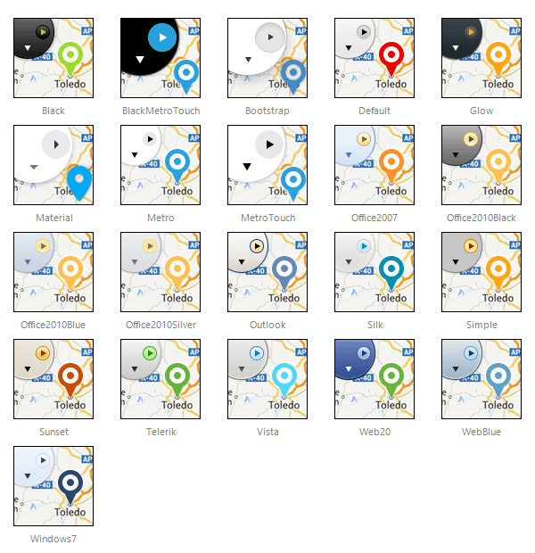

# Skins

**RadMap** uses **skins** to control its overall look-and-feel. A skin is a set of images and a CSS stylesheet that can be applied to the control elements (items, images, etc.) and defines their appearance.

To apply a skin to a **RadMap** control, set its **Skin** property.

**RadMap** is installed with a number of preset skins. These are shown below:

>note The **Hay** , **Forest** , **Sitefinity** and **Transparent** skins are obsolete and have been removed from the Telerik.Web.UI.Skins.dll assembly as of **Q1 2014** .	You can find more information on the matter in [this blog post](http://blogs.telerik.com/aspnet-ajax/posts/13-04-11/6-telerik-asp.net-ajax-skins-going-obsolete).

# See Also

 * [RadMap Getting Started]()
