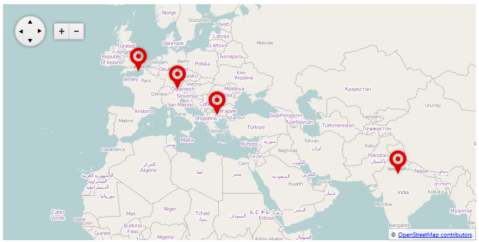

# Server-side


The markers and layers of the __ASP.NET AJAX Map__ control can be bound both	[client-side]() client-side and server-side, as the way to achieve the later is described in this article.	In __Example 1__ you will see how to bind RadMap with a server-side collection, as the result from this sample is shown in __Figure 1__.	You can also use the RadMap's __OnItemCreared__ and __OnItemDataBound__server-side events to additinality manipulaet the data.

## 

__RadMap__ can use the standard data sources for binding an ASP.NET control:

* Declarative ASP.NET data sources (SqlDatasource, ObjectDataSource, LinqDataSource, etc.)

* Server-side collections that implement the __IEnumerable__ interface.
>caption Figure 1: Binding layers and markers in RadMap to a collection of custom objects.



## Binding Markers

Similar to setting a data source for an ASP.NET control, you should either use the __DataSourceID__ property when data binding markers declaratively or__DataSource__ when the data source of the control is set on the server (such is the case in__Example 1__).

The data source should have columns for each of the map fields that you want to specify. For example, if you want to pull the title of the markers from the data source, this will require a separatecolumn that contains the titles of each marker.

The columns of the data source are attached to their corresponding data fields in the markers via the properties with the structure __Data[__in __RadMap > DataBindings > MarkerBinding__. For example: __DataShapeField__, __DataTitleField__, etc.You can find the full set of the MapMarker object's properties in the [Server-Side API of RadMap](http://www.telerik.com/help/aspnet-ajax/t_telerik_web_ui_radmap.html).

Binding the __Marker__'s __Shape__ value can enable you to create an optional, custom look of the bound markers. You can examine the [Customizing Markers in RadMap]() article.

## Binding Layers

Following the same logic, when binding layers you should use either the __LayersDataSourceID__ property when data binding layers declaratively or__LayersDataSource__ when the data source of the control is set on the server (you can refer __Example 1__ for a sample configuration).

The columns of the data source here are also attached to their corresponding data fields in the layers via the properties with the structure __Data[__in __RadMap > DataBindings > LayerBinding__. For example: __DataTypeField__, __DataUrlTemplateField__, etc.You can find the full set of the MapLayer object's properties in the [Server-Side API of RadMap](http://www.telerik.com/help/aspnet-ajax/t_telerik_web_ui_radmap.html).

## Examples

In the example below you will see a way to databind the layers and the markers of a RadMap control to a server-side object. The result of this code is shown in__Figure 1__.

__Example 1__: Data binding layers and markers in a map to a collection of custom objects.

````ASPNET
			<telerik:RadMap runat="server" ID="RadMap1" Zoom="3" Width="800" Height="400">
				<CenterSettings Latitude="40" Longitude="30" />
				<DataBindings>
					<LayerBinding
						DataTypeField="type"
						DataUrlTemplateField="urlTemplate"
						DataAttributionField="attribution"
						DataSubdomainsField="subdomains"
						DataMaxZoomField="maxZoom"
						DataMinZoomField="minZoom"
						DataOpacityField="opacity" />
					<MarkerBinding
						DataShapeField="shape"
						DataTitleField="title"
						DataLocationLatitudeField="locationLatitude"
						DataLocationLongitudeField="locationLongitude"
						DataTooltipTemplateField="tooltipTemplate" />
				</DataBindings>
			</telerik:RadMap>
````


````C#
			protected void Page_Load(object sender, EventArgs e)
		{
			if (!IsPostBack)
			{
				RadMap1.LayersDataSource = GetLayers();
				RadMap1.DataSource = GetMarkers();
				RadMap1.DataBind();
			}
		}
	
		private IEnumerable GetLayers()
		{
			return new[] {
				new {type=Telerik.Web.UI.Map.LayerType.Tile,
					urlTemplate="http://#= subdomain #.tile.openstreetmap.org/#= zoom #/#= x #/#= y #.png",
					attribution="&copy; <a href='http://osm.org/copyright' title='OpenStreetMap contributors' target='_blank'>OpenStreetMap contributors</a>.",
					subdomains="a,b,c",
					maxZoom="3",
					minZoom="1",
					opacity="1"
				}
			};
		}
	
		private IEnumerable GetMarkers()
		{
			return new[] {
				new {shape="pinTarget", title="Sofia",   locationLatitude=42.650613, locationLongitude=23.379025, tooltipTemplate="#= location.lat # #= marker.options.title #"},
				new {shape="pinTarget", title="Munich",  locationLatitude=48.117227, locationLongitude=11.601990, tooltipTemplate="#= location.lat # #= marker.options.title #"},
				new {shape="pinTarget", title="London",  locationLatitude=51.515986, locationLongitude=-0.085798, tooltipTemplate="#= location.lat # #= marker.options.title #"},
				new {shape="pinTarget", title="Gurgaon", locationLatitude=28.410139, locationLongitude=77.042439, tooltipTemplate="#= location.lat # #= marker.options.title #"}
			};
	
````
````VB
		Protected Sub Page_Load(sender As Object, e As EventArgs) Handles Me.Load
			If Not IsPostBack Then
				RadMap1.LayersDataSource = GetLayers()
				RadMap1.DataSource = GetMarkers()
				RadMap1.DataBind()
			End If
		End Sub
	
		Private Function GetLayers() As IEnumerable
			Return New Object() {New With { _
				.type = Telerik.Web.UI.Map.LayerType.Tile, _
				.urlTemplate = "http://#= subdomain #.tile.openstreetmap.org/#= zoom #/#= x #/#= y #.png", _
				.attribution = "&copy; <a href='http://osm.org/copyright' title='OpenStreetMap contributors' target='_blank'>OpenStreetMap contributors</a>.", _
				.subdomains = "a,b,c", _
				.maxZoom = "3", _
				.minZoom = "1", _
				.opacity = "1" _
			}}
		End Function
	
		Private Function GetMarkers() As IEnumerable
			Return New Object() {
				New With {.shape = "pinTarget", .title = "Sofia", .locationLatitude = 42.650613, .locationLongitude = 23.379025, .tooltipTemplate = "#= location.lat # #= marker.options.title #"},
				New With {.shape = "pinTarget", .title = "Munich", .locationLatitude = 48.117227, .locationLongitude = 11.60199, .tooltipTemplate = "#= location.lat # #= marker.options.title #"},
				New With {.shape = "pinTarget", .title = "London", .locationLatitude = 51.515986, .locationLongitude = -0.085798, .tooltipTemplate = "#= location.lat # #= marker.options.title #"},
				New With {.shape = "pinTarget", .title = "Gurgaon", .locationLatitude = 28.410139, .locationLongitude = 77.042439, .tooltipTemplate = "#= location.lat # #= marker.options.title #"}
			}
	
		End Function
````


# See Also

 * [RadMap Server-Side API](http://www.telerik.com/help/aspnet-ajax/t_telerik_web_ui_radmap.html)
