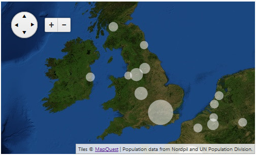
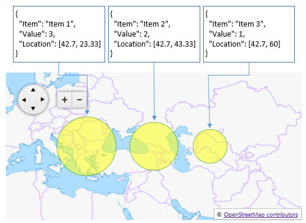
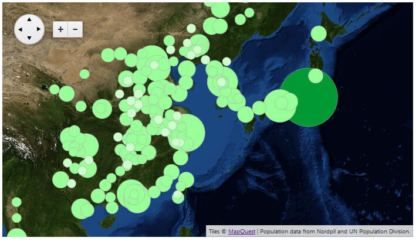

# Bubble Layer

This article shows how to use, configure and data bind the **Bubble** layer type of the Telerik Map control for ASP.NET AJAX.

The **Bubble** layer type is available since the **Q3 2014** release.

>caption **Figure 1**: Simple RadMap with a Bubble layer, which is a result of the code in Example 1.



Quick navigation:

1. [Overview](#overview)

1. [Client-side Data Binding](#client-side-data-binding)

1. [Custom Stylization](#custom-stylization)

1. [Using Client-side Events and Bubble Shapes](#using-client-side-events-and-bubble-shapes)

## Overview

The **Bubble** type of layer lets you create circular shapes on a geographic position with a radius that is calculated via the value associated with the shape.

The **radiuses of the bubbles** are automatically calculated by the map control, based on the maximum and minimum values available in the data source. **Example 2** demonstrates how simple values reflect on the radius of the circular shapes.

Just like the [Shape layer](), populating bubbles/shapes is done only via [client-side data binding](#client-side-data-binding). The data source fields that represent the location and the value of the shapes can be defined via the **LocationField** and **ValueField** properties of the **MapLayer** item. **Example 1** shows a basic data binding configuration by using the **RadClientDataSource** control.

Optionally, the bubbles can also be styled by using the **StyleSettings** inner tag. You can find more about this in the [Custom Stylization](#custom-stylization) section.

User interaction, data source relations and dynamic modifications can be achieved via the [Client-side Events](#using-client-side-events-and-bubble-shapes) of the **RadMap** control and their exposed event arguments.

## Client-side Data Binding

Adding shapes in the **Bubble** layer can be done only by binding it to a client-side data source.

The **Bubble** layer can be easily integrated with the **RadClientDataSource** control and bound to a **.json** file that contains the JSON literal—the data source. To do this, set the **ClientDataSourceID** property of the **MapLayer** item to the RadClientDataSource control’s **ID**.

In **Example 1**, the *urban-areas.json* file is the one that contains the data and defines the shapes on the **Bubble** layer. You can download the file from the [Bubble Layer](https://demos.telerik.com/aspnet-ajax/map/examples/functionality/bubble-layer/defaultcs.aspx) demo and examine the structure of the JSON literal. **Figure 1** is a result of the markup from **Example 1**.

>caption **Example 1**: Data binding a Bubble layer to a RadClientDataSource.

````ASP.NET
<telerik:RadClientDataSource runat="server" ID="RadClientDataSource1">
	<DataSource>
		<WebServiceDataSourceSettings>
			<Select Url="urban-areas.json" DataType="JSON" />
		</WebServiceDataSourceSettings>
	</DataSource>
</telerik:RadClientDataSource>

<telerik:RadMap RenderMode="Lightweight" runat="server" ID="RadMap1">
	<CenterSettings Latitude="23" Longitude="10" />
	<LayersCollection>
		<telerik:MapLayer Type="Tile" Subdomains="a,b,c"
			UrlTemplate="https://otile3.mqcdn.com/tiles/1.0.0/sat/#= zoom #/#= x #/#= y #.png"
			Attribution="Tiles &copy; <a href='https://www.mapquest.com/' target='_blank'>MapQuest</a>">
		</telerik:MapLayer>
		<telerik:MapLayer Type="Bubble" ClientDataSourceID="RadClientDataSource1" LocationField="Location" ValueField="Pop2010"
			Attribution="Population data from Nordpil and UN Population Division.">
		</telerik:MapLayer>
	</LayersCollection>
</telerik:RadMap>
````

The data source items should contain two important fields: location and value (**Example 2**).

* **location** field—it should be a geographical position represented by a JavaScript array with the latitude and longitude values.

* **value** field—it depends on the purpose of the data that should be displayed, the value’s weight is the magnitude used to calculate the radius of each circle shape.

>caption **Example 2**: JSON literal of a simple, valid data item.

````JavaScript
{
	"Location": [42.7, 60.0],
	"Value": 543
}
````

**Figure 2** is the result of the simple data binding scenario from **Example 3**. You can see how the *"Value"* field set to the **ValueField** property of the **Bubble** layer affects the radius of the circle shapes.

>caption **Figure 2**: Value and circle radius dependency in the bubble shapes.



>caption **Example 3**: Simple data binding of a Bubble layer

````ASP.NET
<script type="text/javascript">
	var markerData = [
		{
			"Item": "1",
			"Value": 3,
			"Location": [42.7, 23.33]
		}, {
			"Item": "2",
			"Value": 2,
			"Location": [42.7, 43.33]
		}, {
			"Item": "3",
			"Value": 1,
			"Location": [42.7, 60]
		}
	];

	function OnInitialize(sender, args) {
		var originalOptions = args.get_options();
		originalOptions.layers[1].dataSource = { data: markerData };
		args.set_options(originalOptions);
	}
</script>

<telerik:RadMap RenderMode="Lightweight" runat="server" ID="RadMap1" Width="500px" Height="250px">
	<ClientEvents OnInitialize="OnInitialize" />
	<CenterSettings Latitude="42.7" Longitude="43.33" />
	<LayersCollection>
		<telerik:MapLayer Type="Tile" Subdomains="a,b,c"
			UrlTemplate="http://#= subdomain #.tile2.opencyclemap.org/transport/#= zoom #/#= x #/#= y #.png"
			Attribution="� <a href='https://osm.org/copyright' title='OpenStreetMap contributors' target='_blank'>OpenStreetMap contributors</a>.">
		</telerik:MapLayer>
		<telerik:MapLayer Type="Bubble" LocationField="Location" ValueField="Value">
			<StyleSettings>
				<FillSettings Color="Yellow" />
				<StrokeSettings Color="Green" Width="1" />
			</StyleSettings>
		</telerik:MapLayer>
	</LayersCollection>
</telerik:RadMap>
````

## Custom Stylization

By default, the bubbles on the **Bubble** layer are colorized according to the set [Skin]().Optionally, you can change their appearance according to your design requirements.

To do so, you can use the **FillSettings** and **StrokeSettings** tags exposed in the **StyleSettings** of the used **MapLayer**. More details about the available attributes and how to configure them are available in the [Kendo Map online documentation](https://docs.telerik.com/kendo-ui/api/javascript/dataviz/ui/map#configuration-layerDefaults.shape.style).

Simple markup demonstration of a custom shape stylization with the described settings is provided in **Example 3** and you can see the result in **Figure 2**.

## Using Client-side Events and Bubble Shapes

You can dynamically alter the look and behavior of the **Bubble** layer or implement some user-interaction capabilities by using the [client-side events of the RadMap control]() and changing the [style attributes of the shape](https://docs.telerik.com/kendo-ui/api/javascript/dataviz/ui/map#configuration-layerDefaults.bubble.style) according to your logic (**Example 4**).

>tip To manipulate the bubbles you should use the **Shape** related events, i.e.,[OnShapeCreated](https://docs.telerik.com/kendo-ui/api/javascript/dataviz/ui/map#events-shapeCreated), [OnShapeClick](https://docs.telerik.com/kendo-ui/api/javascript/dataviz/ui/map#events-shapeClick), [OnShapeMouseEnter](https://docs.telerik.com/kendo-ui/api/javascript/dataviz/ui/map#events-shapeMouseEnter) and [OnShapeMouseLeave](https://docs.telerik.com/kendo-ui/api/javascript/dataviz/ui/map#events-shapeMouseLeave).

In **Example 3**, you can see how the **OnShapeCreated** event is used to alter the fill-color of the bubbles based on the value of the shape objects. **Figure 3** shows the rendered map as a result of the custom implementation.

>caption **Figure 3**: Changing bubbles’ fill-color based on custom logic.



>caption **Example 4**: Using the OnShapeCreated event to dynamically change the shapes of a Bubble layer.

````ASP.NET
<script type="text/javascript">
	_minRangePopulation = 892,
	_mediumRangePopulation = 17840,
	_maxRangePopulation = 24976;

	function OnShapeCreated(evt) {
		var shape = evt.shape,
			value = shape.value;


		if (value < _minRangePopulation) {
			shape.options.set("fill", { color: "#CCFFCC" });
		}else if (value >= _minRangePopulation && value < _mediumRangePopulation) {
			shape.options.set("fill", { color: "#99FF99" });
		} else if (value >= _mediumRangePopulation && value < _maxRangePopulation) {
			shape.options.set("fill", { color: "#66FF66" });
		} else {
			shape.options.set("fill", { color: "#009933" });
		}
	}
</script>

<telerik:RadClientDataSource runat="server" ID="RadClientDataSource1">
	<DataSource>
		<WebServiceDataSourceSettings>
			<Select Url="urban-areas.json" DataType="JSON" />
		</WebServiceDataSourceSettings>
	</DataSource>
</telerik:RadClientDataSource>

<telerik:RadMap RenderMode="Lightweight" runat="server" ID="RadMap1" Zoom="1" Width="700" Height="400">
	<ClientEvents OnShapeCreated="OnShapeCreated" OnShapeClick OnShapeMouseEnter OnShapeMouseLeave/>
	<CenterSettings Latitude="23" Longitude="10" />
	<LayersCollection>
		<telerik:MapLayer Type="Tile" Subdomains="a,b,c"
			UrlTemplate="https://otile3.mqcdn.com/tiles/1.0.0/sat/#= zoom #/#= x #/#= y #.png"
			Attribution="Tiles &copy; <a href='https://www.mapquest.com/' target='_blank'>MapQuest</a>">
		</telerik:MapLayer>
		<telerik:MapLayer Type="Bubble" ClientDataSourceID="RadClientDataSource1" LocationField="Location" ValueField="Pop2010"
			Attribution="Population data from Nordpil and UN Population Division.">
		</telerik:MapLayer>
	</LayersCollection>
</telerik:RadMap>
````

# See Also

 * [Overview]()

 * [Shapes]()

 * [Client-side Programming]()

 * [Client-side]()

 * [Kendo Map API Reference](https://docs.telerik.com/kendo-ui/api/javascript/dataviz/ui/map)

 * [Live Demo: Bubble Layer](https://demos.telerik.com/aspnet-ajax/map/examples/functionality/bubble-layer/defaultcs.aspx)
