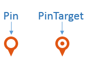

# Markers


This article will demonstrate how to add and configure __Markers__ using the __RadMap__ control.	The marker functionality allows you to add points in the map. These points are defined by geographical position in the map and can show useful information to the user in a tooltip.

A simple illustration of a __Marker__ in a __RadMap__ is available in the [RadMap Structure]() article.

## How to Add Markers

The markers in the __RadMap__ are represented as a collection of objects. To add a simple marker:

1. Use the __MarkersCollection__ inner tag;

1. Add a __MapMarker__ item;

1. Use the __LocationSettings__ inner tag and its __Latitude__ and __Longitude__attributes to define the location of the marker.

1. Optionally, you can set the __Shape__ attribute to a desirable value (__Pin__ or __PinTarget__);

1. Optionally, set the __Title__ attribute with some HTML content (if a tooltip is not configured this content will be shown as a tooltip of the __Marker__).

In __Example 1__ you can examine a sample markup created by following the above steps anda code behind approach is available in __Example 2__.

__Example 1__: Adding a simple __Marker__ in __RadMap__ with ASP.NET markup

````ASPNET
			<telerik:RadMap runat="server" ID="RadMap1">
				<MarkersCollection>
					<telerik:MapMarker Shape="Pin" Title="This is <strong>HTML</strong> markup">
						<LocationSettings Latitude="51.500925" Longitude="-0.124507" />
					</telerik:MapMarker>
				</MarkersCollection>
			</telerik:RadMap>
````


__Example 2__: Programmatic approach to add a simple __Marker__ in __RadMap__


````ASPNET
			<telerik:RadMap runat="server" ID="RadMap1">
			</telerik:RadMap>
````
````C#
			MapMarker myMarker = new MapMarker();
			myMarker.Shape = Telerik.Web.UI.Map.MarkerShape.Pin;
			myMarker.Title = "This is <strong>HTML</strong> markup";
			myMarker.LocationSettings.Latitude = 51.500925;
			myMarker.LocationSettings.Longitude = -0.124507;
	
			RadMap1.MarkersCollection.Add(myMarker);
````
````VB
			Dim myMarker As MapMarker = New MapMarker
			myMarker.Shape = Telerik.Web.UI.Map.MarkerShape.Pin
			myMarker.Title = "This is <strong>HTML</strong> markup"
			myMarker.LocationSettings.Latitude = 51.500925
			myMarker.LocationSettings.Longitude = -0.124507
	
			RadMap1.MarkersCollection.Add(myMarker)
````


## Marker Shapes

The Markers in __RadMap__ are two types - __Pin__ and __PinTarget__ (see __Figure 1__).They can be defined using the __Shape__ attribute of the __MapMarker__ item. The actual visual differences depend on the chosen Skin. The default visual appearance of the __Marker__ is the __PinTarget__.

__Figure 1__ shows the differences of the two types when __RadMap__ is set to Default skin.	The markup that generates the displayed map is provided in __Example 3__.
>caption Figure 1: Different Marker Shapes with the Default Skin



__Example 3__: Setting __Marker__ shapes

````ASPNET
			<telerik:RadMap runat="server" ID="RadMap1" Skin="Default" Zoom="4">
				<CenterSettings Latitude="1" Longitude="1" />
				<MarkersCollection>
					<telerik:MapMarker Shape="Pin">
						<LocationSettings Latitude="1" Longitude="1" />
					</telerik:MapMarker>
					<telerik:MapMarker Shape="PinTarget">
						<LocationSettings Latitude="1" Longitude="10" />
					</telerik:MapMarker>
				</MarkersCollection>
			</telerik:RadMap>
````


## Using Tooltip Settings

The __TooltipSettings__ tag allows you to fine tune the tooltips content, appearance and options.You can add HTML, use templates or load an entire page in the tooltip. You can then configure animations,show and hide delays, etc. You can find a full list of the available settings in the [API reference]().

In __Example 4__ you can see how the marker tooltip is configured to show a[Kendo-type HTML template](http://docs.telerik.com/kendo-ui/api/dataviz/map#configuration-layerDefaults-marker-tooltip-template)	and how the open and close behaviors can be changed.

__Example 4__: Creating a complex tooltip

````ASPNET
			<telerik:RadMap runat="server" ID="RadMap1" Zoom="4">
				<CenterSettings Latitude="1" Longitude="1" />
				<MarkersCollection>
					<telerik:MapMarker Shape="Pin">
						<LocationSettings Latitude="1" Longitude="1"/>
						<TooltipSettings Template="This marker is located at <br /> <strong>#= location.lat #, #= location.lng #</strong>" 
							Width="120" Height="100" AutoHide="false">
							<AnimationSettings>
								<CloseSettings Duration="600" Effects="zoom:out" />
								<OpenSettings Duration="600" Effects="zoom:in" />
							</AnimationSettings>
						</TooltipSettings>
					</telerik:MapMarker>
				</MarkersCollection>
			</telerik:RadMap>
````


# See Also

 * [Server-side Programming]()

 * [Client-side]()

 * [Kendo Map documentation](http://docs.telerik.com/kendo-ui/api/dataviz/map)
