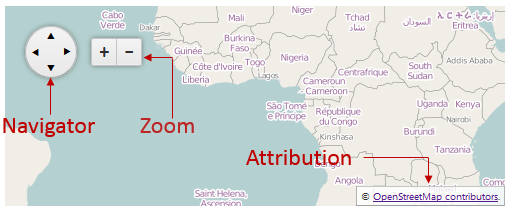
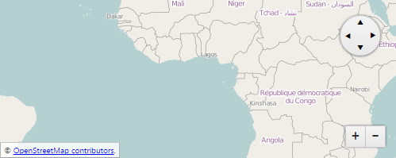

# UI Interaction Controls

In this article you can examine the RadMap’s UI elements the end user can interact with. The Telerik Map provides the following distinct controls – **Navigator**, **Zoom** and **Attribution**.

## End User Experience with the UI Controls

The **Navigator** and the **Zoom** controls allow the user to pan and zoom the map. Their value are persisted through the server post back. The **Attribution** is the map footer where additional information about the Map Tile Service rights could be provided to the end user.

In **Figure 1** you can examine the distinct controls in a simple **RadMap** setup, provided in **Example 1**.

>caption **Figure 1**: Illustration of the Navigator, Zoom and Attribution UI elements.



>caption **Example 1**: UI elements enabled by default in the **RadMap** control.

````ASP.NET
<telerik:RadMap RenderMode="Lightweight" runat="server" ID="RadMap1" Width="500" Height="200">
	<CenterSettings Latitude="1" Longitude="1" />
	<LayersCollection>
		<telerik:MapLayer Type="Tile" Subdomains="a,b,c"
			UrlTemplate="http://#= subdomain #.tile.openstreetmap.org/#= zoom #/#= x #/#= y #.png"
			Attribution="&copy; <a href='http://osm.org/copyright' title='OpenStreetMap contributors' target='_blank'>OpenStreetMap contributors</a>.">
		</telerik:MapLayer>
	</LayersCollection>
</telerik:RadMap>
````

## Controlling the Visibility of the UI Controls

In the **RadMap** you can easily enable or disable the UI controls using the **ControlsSetting** inner tag and set the desired controls to **true** or **false**. If such options are not set, the controls are enabled by default.

**Example 2** demonstrates how to create a Map with disabled **Navigator**, **Zoom** and **Attribution** elements.

>caption **Example 2**: Disabling the **UI Controls** of the **RadMap**.

````ASP.NET
 <telerik:RadMap RenderMode="Lightweight" runat="server" ID="RadMap1">
	<ControlsSettings Attribution="false" Navigator="false" Zoom="false"></ControlsSettings>
	<LayersCollection>
		<telerik:MapLayer Type="Tile" Subdomains="a,b,c"
			UrlTemplate="http://#= subdomain #.tile.openstreetmap.org/#= zoom #/#= x #/#= y #.png"
			Attribution="&copy; <a href='http://osm.org/copyright' title='OpenStreetMap contributors' target='_blank'>OpenStreetMap contributors</a>.">
		</telerik:MapLayer>
	</LayersCollection>
</telerik:RadMap>
````

## Repositioning the UI Controls

In **Example 3** you can see how the **AttributionSettings**, **NavigatorSettings** and **ZoomSettings** inner tags and their **Position** property are used to change the controls’ position. The result is illustrated in **Figure 2**.

>caption **Figure 2**: RadMap with repositioned UI controls.



>caption **Example 3**: How to reposition the Map’s UI controls.

````ASP.NET
 <telerik:RadMap RenderMode="Lightweight" runat="server" ID="RadMap1" Width="500" Height="200">
	<CenterSettings Latitude="1" Longitude="1" />
	<ControlsSettings>
		<AttributionSettings Position="BottomLeft" />
		<NavigatorSettings Position="TopRight" />
		<ZoomSettings Position="BottomRight" />
	</ControlsSettings>
	<LayersCollection>
		<telerik:MapLayer Type="Tile" Subdomains="a,b,c"
			UrlTemplate="http://#= subdomain #.tile.openstreetmap.org/#= zoom #/#= x #/#= y #.png"
			Attribution="&copy; <a href='http://osm.org/copyright' title='OpenStreetMap contributors' target='_blank'>OpenStreetMap contributors</a>.">
		</telerik:MapLayer>
	</LayersCollection>
</telerik:RadMap>
````

# See Also

 * [Overview]()

 * [Server-side Programming]()
