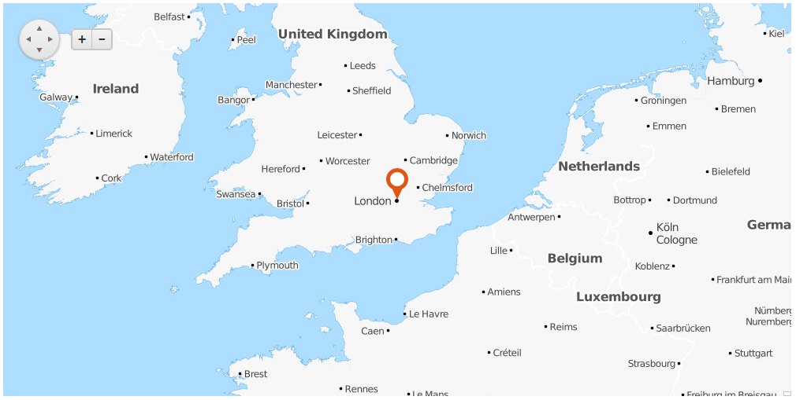

# Getting Started Overview

This article demonstrates how you can start using the **RadMap** control in an ASP.NET project.	The illustrated Map in **Figure 1** will be generated after following the steps and the code examples in the following sections.

>caption **Figure 1**: Result of a basic RadMap configuration



## Add a RadMap control into an ASP.NET project

To add a Map control into the page you can simply drag it from the Visual Studio Toolbox into anASP.NET page with correctly set **ScriptManager** control or paste the markup from **Example 1** into the **form** element.

>caption **Example 1**: Start-up **RadMap** declaration

````ASP.NET
<telerik:RadScriptManager runat="server" ID="RadScriptManager1" />

<telerik:RadMap RenderMode="Lightweight" runat="server" ID="RadMap1">
</telerik:RadMap>
````

## Add a Tile Layer

The layer of type **Tile** is basically rendered using images requested from a corresponding web service. This article uses the	[OpenCycleMap](https://www.opencyclemap.org/) service to populate the map images.

To configure the **RadMap** with the chosen service provider, follow these steps:

1. Use the **LayersCollection** inner tag of the RadMap;

1. Add a **MapLayer** item;

1. Use the **Type** attribute to set the layer type to **Tile**;

1. Use the **UrlTemplate** to set the URL template provided by the service.
	>tip Some providers like [OpenCycleMap](https://www.thunderforest.com/maps/opencyclemap/) may require that you add an API key to the URL, for example: `https://{s}.tile.thunderforest.com/cycle/{z}/{x}/{y}.png?apikey=<insert-your-apikey-here>`

These steps will lead you to a markup similar to the one in **Example 2** and a rendered Map in the page.

>caption **Example 2**: Sample **RadMap** markup with configured Tile Layer

````ASP.NET
<telerik:RadMap RenderMode="Lightweight" runat="server" ID="RadMap1">
	<LayersCollection>
		<telerik:MapLayer Type="Tile" 
			UrlTemplate="http://a.tile.opencyclemap.org/transport/#= zoom #/#= x #/#= y #.png">
		</telerik:MapLayer>
	</LayersCollection>
</telerik:RadMap>
````

## Configure the Layout of the Map

At this point you will already have a Map rendered if you run the page. The following instructions are optional and will explain how to configure it.

With the Telerik Map you can set initial zoom level, initial center location and change the size of the control:

1. Use the **Zoom** property of the **RadMap** to set a value for the initial zoom level (when using the OpenCycleMap service, this value should be between 0 and 18);

1. Set the **Width** and **Height** properties with desirable values to change the size of the map;

1. Add the **CenterSettings** inner tag;

1. Use its **Latitude** and **Longitude** attributes to set the exact location of the map center.

In **Example 3** you can examine a sample code achieved by following these steps.

>caption **Example 3**: Simple layout configuration of the **RadMap**.

````ASP.NET
<telerik:RadMap RenderMode="Lightweight" runat="server" ID="RadMap1" Zoom="6" Width="1000" Height="500" >
	<CenterSettings Latitude="51.525619" Longitude="-0.111802" />
	<LayersCollection>
		<telerik:MapLayer Type="Tile" 
			UrlTemplate="http://a.tile.opencyclemap.org/transport/#= zoom #/#= x #/#= y #.png">
		</telerik:MapLayer>
	</LayersCollection>
</telerik:RadMap>
````

## Place Markers in the Map

Based on the purpose of the Map, you may want to show points of interest. To do so, use the [markers collection]().

To configure a **Marker**:

1. Add the **MarkerCollection** inner tag;

1. Add a **MapMarker** item;

1. Use the **Shape** attribute to set the desired look of the **Marker** (**Pin** or **PinTarget**);

1. Use the **Title** attribute to set the text shown as a tooltip on mouse over;

1. Use the **LocationSettings** inner tag to set the exact position of the marker through the **Latitude** and	**Longitude** attributes.

The code in **Example 4** is a final result of the steps from the above sections and will render the Map displayed in **Figure 1**.

>caption **Example 4**: Adding Markers in the **RadMap**.

````ASP.NET
<telerik:RadMap RenderMode="Lightweight" runat="server" ID="RadMap1" Zoom="6" Width="1000" Height="500" >
	<CenterSettings Latitude="51.525619" Longitude="-0.111802" />
	<LayersCollection>
		<telerik:MapLayer Type="Tile" 
			UrlTemplate="http://a.tile.opencyclemap.org/transport/#= zoom #/#= x #/#= y #.png">
		</telerik:MapLayer>
	</LayersCollection>
	<MarkersCollection>
		<telerik:MapMarker Shape="Pin" Title="London, UK">
			<LocationSettings Latitude="51.525619" Longitude="-0.111802"/>
		</telerik:MapMarker>
	</MarkersCollection>
</telerik:RadMap>
````

# See Also

 * [RadMap Structure]()

 * [Tile Layers]()

 * [Markers]()
