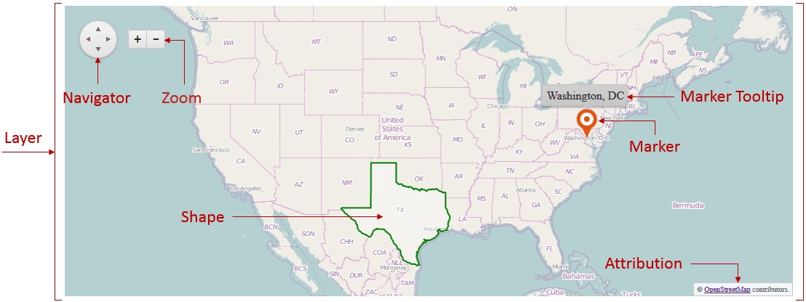

# RadMap Structure

Examine the **RadMap** element structure in **Figure 1**. You can see the names of the UI elements and read more about their purpose.

>caption **Figure 1**: Element structure of the RadMap control

Elements:

* **Layer** – the layer is basically the main element of the map. There are four different types:

	* [Layer]() - rendering the map usingMap Tile Service (e.g.	[OpenStreetMap](http://www.openstreetmap.org));

	* [Bing]() - rendering the map using the	[Bing](https://www.bingmapsportal.com/) service (same as the Tile type, but with simplified setup for Bing’s service);

	* [Shape]() - layer on which additional shapes can be drawn based on collection of	[GeoJSON](http://geojson.org/) objects;

	* [Marker]() - defined by location data and indicates a point of interest based on some criteria.

* **Navigator** - allows the user to pan through the map;

* **Zoom** - allows the user to zoom-in and zoom-out the map;

* **Marker Tooltip** - developer-defined text that is shown on mouse click or mouse over of a marker;

* **Attribution** - developer-defined footer element that can show additional information to the user, e.g. a copyright notice.

# See Also

 * [Overview]()

 * [OpenStreetMap service](http://www.openstreetmap.org)

 * [Bing service](https://www.bingmapsportal.com/)

 * [GeoJSON](http://geojson.org/)
