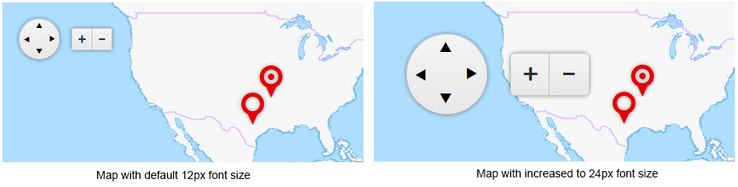

# Elastic Design

This article explains the **elastic design capabilities RadMap offers**. The example bellow shows the simple approach you can use to to resize and scale the control by only changing its default font size.

@[template](/_templates/common/render-mode.md#resp-design-desc "slug-el: no, slug-fl: map/mobile-support/fluid-design")

## Elastic Design with RadMap

>caption **Figure 1**: Comparison between a RadMap with the default 12px font size and with increased font-size.



**RadMap** does not create elastic design by itself, but can fit in a page that follows this pattern.This means that you can change its font size without breaking the control's appearance - if the new size is larger than the original,the elements in the control will simply increase their size.This fluid layout is achieved by using `em` units for setting dimensions and paddings in the control,instead of `px` because em units are tied to the font size.This allows dimensions and sizes to scale with the font size.

**Example 1:** How to increase the font size of a RadMap as shown in **Figure 1**.

````XML
<style type="text/css">
	div.RadMap
	{
		font-size: 24px;
	}
</style>
	<telerik:RadMap runat="server" ID="RadMap1" Width="450px" Height="200px" Zoom="3">
	<CenterSettings Latitude="38" Longitude="-113" />
	<LayersCollection>
		<telerik:MapLayer Type="Tile" UrlTemplate="http://a.tile.opencyclemap.org/transport/#= zoom #/#= x #/#= y #.png">
		</telerik:MapLayer>
	</LayersCollection>
	<MarkersCollection>
		<telerik:MapMarker Shape="Pin" Title="Marker 1">
			<LocationSettings Latitude="30.2681" Longitude="-97.7448" />
		</telerik:MapMarker>
		<telerik:MapMarker Shape="PinTarget" Title="Marker 2">
			<LocationSettings Latitude="35.2681" Longitude="-93.7448" />
		</telerik:MapMarker>
	</MarkersCollection>
</telerik:RadMap>
````

# See Also

 * [Fluid Design]()
