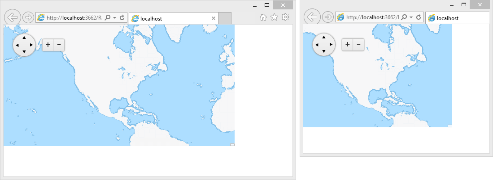

# Fluid Design


This article explains the __fluid design capabilities RadMap offers__.	The example below shows how you can set its size in percent so it can resize with its parent element and refresh it when needed.

Generally, responsive design means that the page and its content are able to adapt to different screen resolutions without deteriorating the user experience.	This often includes [changing the font size]() and having dimensions set in percent.

## Fluid Design with RadMap
>caption Figure 1: RadMap with dimensions set to 100% that occupies its entire parent element



You can set the __Width__ and __Height__ properties of the __RadMap__ in __percent__.This lets it resize together with its parent element. The control has no way of knowing its parent size has changed, however,so the developer needs to invoke the `resize()`[client-side method]() of the map so it can refresh the size of its tile layer.You can find a small sample in __Example 1__.

__Example 1__: Markup and script that provide a fluid RadMap that changes size with the browser viewport

````XML
			<style type="text/css">
				html, body, form
				{
					margin: 0;
					padding: 0;
					height: 100%;
				}
			</style>
			<script type="text/javascript">
				function resizeMap() {
					$find("<%=RadMap1.ClientID %>").kendoWidget.resize();
				}
				var TO = false;
				$telerik.$(window).resize(function () {
					if (TO !== false)
						clearTimeout(TO);
					TO = setTimeout(resizeMap, 200);
				});
			</script>
			<div style="width: 80%; height: 80%;">
				<telerik:RadMap runat="server" ID="RadMap1" Width="100%" Height="100%" Zoom="2">
				<CenterSettings Latitude="38" Longitude="-105" />
				<LayersCollection>
					<telerik:MapLayer Type="Tile" UrlTemplate="http://a.tile.opencyclemap.org/transport/#= zoom #/#= x #/#= y #.png">
					</telerik:MapLayer>
				</LayersCollection>
			</telerik:RadMap>
			</div>
````


# See Also

 * [Elastic Design]()

 * [Client-side Programming]()
