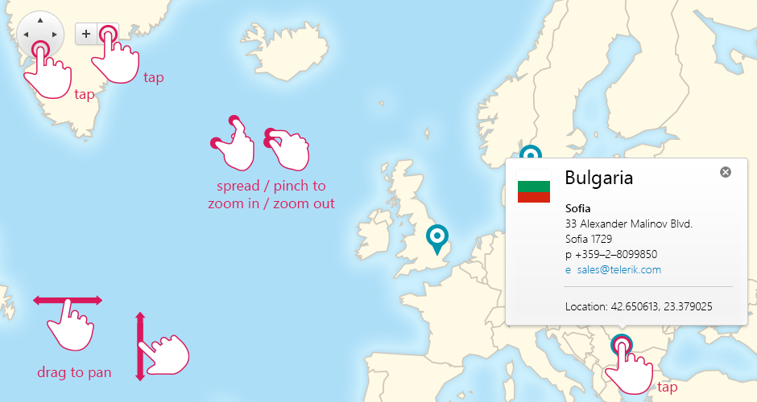

# Gestures Support

## 

__RadMap__ for ASP.NET AJAX handles gestures from touch enabled screens. You can use thetap, drag, spread and pinch gestures to perform the following actions:

* __Pan__ — In order to pan through the map you can either __tap on the navigator buttons__ or __drag the layer__.

* __Zoom__ — In order to zoom-in and zoom-out the map you can either __tap on the zoom buttons__ or __spread/pinch the layer__.

* __Display marker tooltip__ — In order to display a marker tooltip you can __tap on a marker__.

* __Attribution navigation__ — In order to navigate to the attribution URL you can __tap on the attribution element__.

__Figure 1__ illustrates how to use touch device gestures on __RadMap__.
>caption Figure 1: RadMap handles tap, drag, spread and pinch gestures on touch devices.

# See Also

 * [Overview]()

 * [RadMap Structure]()
