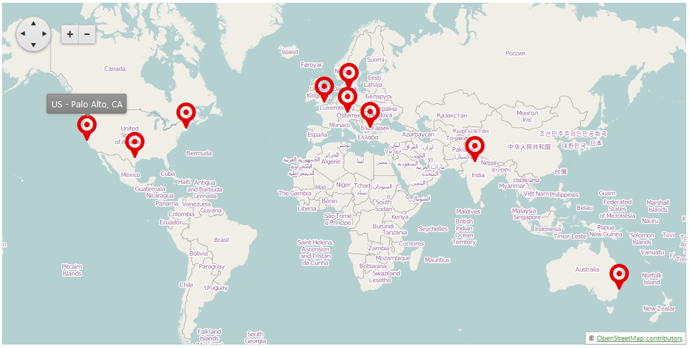

# Map Overview

__RadMap__ for ASP.NET AJAX is a control powered by the	[Kendo UI DataViz Map](http://demos.telerik.com/kendo-ui/map/index) widget.	This control simplifies the setup of Map Tile Services with	[OpenStreetMap](http://www.openstreetmap.org/#map=8/42.745/25.494) and	[Bing](https://www.bingmapsportal.com/).	You can use different Shape layers and GeoJSON data to create helpful map modules in ASP.NET web applications.	The rich built-in functionality of the Map allows you to add and control predefined layouts, markers, tooltips, zoom levels,	UI elements and many more.

## 

The __RadMap__ control in the Telerik UI for ASP.NET AJAX suite is available since __2014 Q2__ version.

The control offers a rich set of features:

* Zoom and pan (mouse and touch support plus dedicated UI elements).

* Support for multiple layers.

* Markers.

* Marker tooltips.

* Support for [Bubble layer]().

* Custom shape definition through [GeoJSON](http://geojson.org/) objects.

* Client-side data binding.

* Server-side data binding.

* Rich client-side API.

* Multiple client-side events.

Here is an example of what you can achieve with the control:
>caption Figure 1: Demonstrates a RadMap in an ASP.NET page

# See Also

 * [RadMap Online Examples](http://demos.telerik.com/aspnet-ajax/map)

 * [Overview]()

 * [UI Interaction Controls]()
