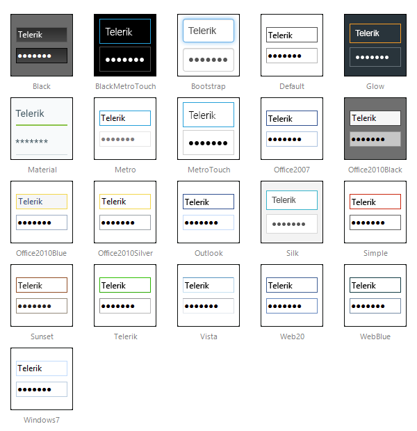

# Skins


The **RadInput** controls use **skins** to control their overall look-and-feel. A skin is a set of images and a *CSSstylesheet* that can be applied to the control elements (textbox, buttons, label) and defines their look and feel. To apply a skin to a **RadInput** control, set its **Skin** property, either using the properties pane or the input control's [Smart Tag]().

The **RadInput** controls are installed with a number of preset skins. These are shown below:




## Not using skins

If you do not set the **Skin** property, the **RadInput** control automatically uses the "*Default*" skin. If you do not want to use a skin with your **RadInput** control, set its **Skin** property to an empty string. If you also want to prevent the control's base stylesheet from registering, please set **EnableEmbeddedBaseStylesheet** to **false**. The base stylesheet contains CSS styles, which are applied to the **RadInput** control instances, regardless of their skin name, because these styles are the same for all skins. The RadInput base styles include alignment, border widths, paddings, etc.

When the input control is not skinned, its wrapper element class is rendered without the suffix "_[*SkinName*]" and the textbox element has no CSS class at all. The latter facilitates textbox styling with **RadFormDecorator** or with some generic CSS styles from the web application. By default (when not skinned) the input element is rendered with border *2px* and padding *1px*. The default rendering of the input area has the style attribute "*width: 100%*" and is nested in a table cell. In *IE*, this causes the right border to be cut off. You can correct for this problem by setting padding-right to be twice the border (for both the left and the right side of the input). That is, you should set the "*padding-right: 6px*". The *CSS* class **RadInput** is rendered to the input wrapper element, so you can apply the padding setting to it as shown below:

````ASPNET
<head runat="server">
	<style type="text/css">
		.RadInput, .RadInput table
		{
			padding-right: 6px;
		}
	</style>
</head>
<body class="body">
	<form runat="server" id="mainForm" method="post">
	<asp:ScriptManager ID="ScriptManager1" runat="server">
	</asp:ScriptManager>
	<telerik:RadNumericTextBox ID="RadNumericTextBox1" runat="server" EnableEmbeddedSkins="false" Skin="">
	</telerik:RadNumericTextBox>
	</form>
</body>
````


## Customizing Skins

You can tweak the existing skins, or create your own. Each skin has two main elements: images and a stylesheet. When creating your own skin, it is a good idea to start with the stylesheet of an existing skin and alter that. See [Tutorial: Creating a Custom Skin]() for a step-by-step walk through. To use your own skin:

1. Add the new *CSS* file to your project.

1. Drag and drop the *CSS* file from the *Project Explorer* onto your *Web**page*.

1. Set the **EnableEmbeddedSkins** property of the input control to **False**.

The RadInput base stylesheet is called **Input.css** and is placed in the **...Skins/** directory. The stylesheet for a **RadInput** skin has the name **Input.[SkinName].css** and can be found in the **...Skins/[SkinName]** directory. The images are found in the **...Skins/[SkinName]/Input** directory. For example, the stylesheet for the "*Black*" skin is called *Input.Black.css * and is located in the ...*Skins/Black* directory. The images are found in the ...*Skins/Black/Input * directory. The images are referenced by name from within the stylesheet.

For more information on the *CSS* File structure, see [Understanding the Skin CSS File]().

# See Also

 * [Styles]()
