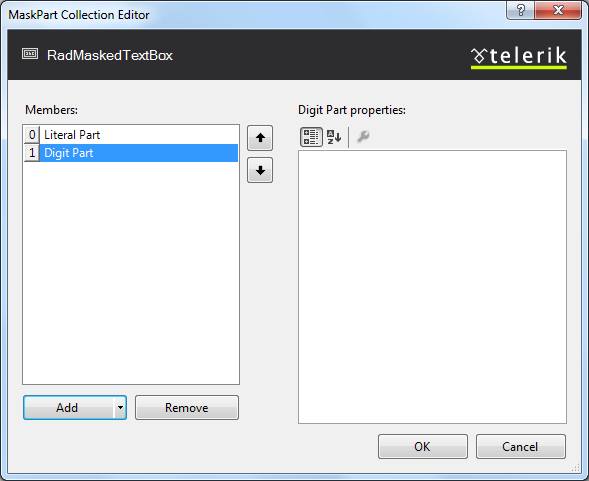

# MaskPart Collection Editor

The **MaskPart Collection Editor** lets you create and modify the masks that are the values of the **RadMaskedTextBox** control's **Mask** and **DisplayMask** properties. You can display the MaskPart Collection Editor in two ways:

* From the **RadMaskedTextBox** properties pane, click the ellipsis button next to the **MaskPart** property. When you bring up the MaskPart Collection Editor in this way, the mask you create is assigned to the **Mask** property, which controls the mask that is used when the user can edit the value.

* From the **RadMaskedTextBox** properties pane, click the ellipsis button next to the **DisplayMaskPart** property. When you bring up the MaskPart Collection Editor in this way, the mask you create is assigned to the **DisplayMask** property, which controls the format of the value when the masked text box does not have focus.
>caption

The **MaskPart Collection Editor** lets you define an input mask by building it up out of its constituent parts.

* To add a new part to the mask, click the **Add** button. Clicking the drop-down arrow on the Add button lets you choose the type of mask part to add next. The choices are

* **LiteralMaskPart**: A literal string that is included in the mask. When adding literal mask parts, set its **Text** property to the string that is its value. The user is not required to enter literal mask parts.

* **DigitMaskPart**: A mask part where the user can enter a digit or space.

* **EnumerationMaskPart**: A mask part where the user must select one from a set of predefined options. When adding enumeration mask parts, set the mask part's **Items** property to specify the enumerated values. When you click the ellipsis button next to the **Items** property, the **String Collection Editor** appears where you can enter the options.

* **NumericRangeMaskPart**: A mask part where the user must enter an integer between a specified minimum and maximum value (inclusive). When adding a numeric range mask part, use its **LowerLimit** and **UpperLimit** properties to specify the limits of the range.

* **LowerMaskPart**: A mask part where the user must enter a single lower-case letter. Only letters in the range **a..z** are allowed (no extended characters).

* **UpperMaskPart**: A mask part where the user must enter a single upper-case letter. Only letters in the range **A..Z** are allowed (no extended characters).

* **FreeMaskPart**: A mask part where the user can enter any text (including nothing at all).

* To remove a mask part, select the mask part and click the **Remove** button.

* To rearrange the mask parts, select a mask part and click on the up or down button to change its position in the list.

# See Also

 * [Input Mask Dialog]()

 * [Masks]()
