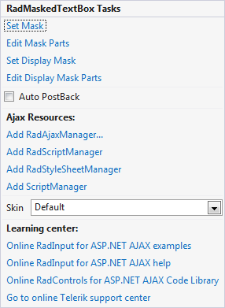

# Smart Tag

The **RadInput** Smart Tag allows easy access to frequently needed tasks. You can display the **Smart Tag** by right clicking on a **RadInput** control in the design window, and choosing **Show Smart Tag** from its context menu.

## RadMaskedTextBox

The **RadMaskedTextBox** Smart Tag contains the same **Ajax Resources**, **Skin**, and **Learning Center** sections as the other **RadInput** controls. In addition, the **RadMaskedTextBox** Smart Tag lets you do the following :

RadMaskedTextBox Tasks

* **Set Mask** brings up the [Input Mask Dialog](), where you can specify an input mask that controls what input the user can enter into the masked text box.The input mask you specify in this dialog is assigned to the **Mask** property.

* **Edit Mask Part** shows the [MaskPart Collection Editor ](), where you can create and modify the masks that are the values of the **RadMaskedTextBox**.

