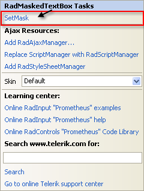
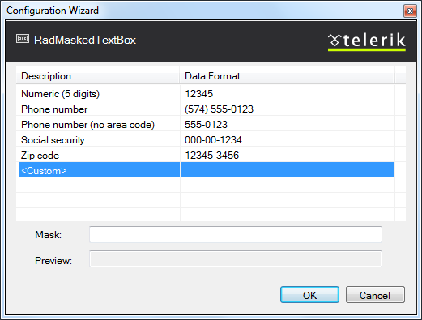

# Getting Started With RadMaskedTextBox

This tutorial will walk you through creating a Web page that uses the **RadMaskedTextBox** controls. It shows how to:

* Use the **RadMaskedTextBox**.

* Apply a **Skin** to customize the look and feel.

* Add labels to the input controls.

* Add messages to appear when nothing is entered.

* Customize the selection behavior when the control receives focus.

* Specify formats for display and editing.

1. Drag a **RadMaskedTextBox** control from the toolbox onto your Web page. It's Smart Tag should appear automatically.

1. In the designer, right-click the **RadMaskedTextBox** control and choose **Properties** from its context menu

1. In the properties pane for the **RadMaskedTextBox** control, set the **Label** property to "Mask:". Note that a label automatically appears in the **RadMaskedTextbox** control.

1. In the **Behavior** section of the properties pane, locate the **SelectionOnFocus** property and change it to "SelectAll". This causes the entire text in the text box to become selected when focus moves to the text box so that it is replaced when the user starts typing. Other options move the caret to the beginning or end of the text box.

1. In the **RadMaskedTextBox** Smart Tag, click the link labelled **SetMask**:

1. The [Input Mask dialog]() appears. In the dialog, choose the mask for **Phone number** hand click **OK**.

1. Choose the "Office2007" Skin in the Smart Tag so that the masked text box matches the other text box on your page.

1. Experiment with entering data in the controls:

* On the **RadMaskedTextBox** control, note that the edit mask appears when you move focus to the control. Try to enter a non-numeric value. It is rejected by the control because it does not match the mask.

