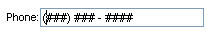
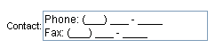

# RadMaskedTextBox Overview


**RadMaskedTextBox** is an enhanced data entry control that uses a [mask]() to distinguish between proper and improper user input. It shares the [common properties of all RadInput controls](), including support for skins, styles for different states, empty message support, conditional postback on text change, flexible caret and button positioning, labels, and so on.

You can use a mask to specify the accepted format such as IP address, telephone number, currency, and so on. In addition, you can use **RadMaskedTextBox** together with [validators]() such as the **RequiredValidator** and **RegularExpressionValidator** controls to enforce any custom validation logic.

## Specifying the mask

At design time, to specify the mask that **RadMaskedTextBox** uses to identify proper user input, set the **Mask** property. There are three ways to set the **Mask** property at design time:

* Type the mask string directly onto the **Mask** property in the properties pane. This is the most direct method, but provides the least design-time support.

* From the **RadMaskedTextBox** [Smart Tag](), choose **SetMask** to bring up the [Input Mask Dialog](). This method lets you choose from pre-defined masks or enter your own custom mask and get immediate feedback about what the masked text box displays as a prompt to the user for that mask.

* Click the ellipsis button next to the **MaskParts** property in the properties pane to bring up the [MaskPart Collection Editor](). This method lets you build up the mask bit by bit, so that you can easily configure each part of the mask using mask part properties. When you set the **MaskParts** property, the **Mask** property is automatically updated to the mask you build.

At run time, you can set the mask in the following ways:

* Set the **Mask** property:


````C#
RadMaskedTextBox1.Mask = "(###) ### - ####";
````
````VB.NET
RadMaskedTextBox1.Mask = "(###) ### - ####"
````


* Build up a mask using the **MaskParts** property:


````C#
EnumerationMaskPart enumPart = new EnumerationMaskPart();
enumPart.Items.Add("Mon");
enumPart.Items.Add("Tue");
enumPart.Items.Add("Wed");
enumPart.Items.Add("Thu");
enumPart.Items.Add("Fri");
enumPart.Items.Add("Sat");
enumPart.Items.Add("Sun");
RadMaskedTextBox1.MaskParts.Add(enumPart);
LiteralMaskPart literalPart = new LiteralMaskPart();
literalPart.Text = " ";
RadMaskedTextBox1.MaskParts.Add(literalPart);
RadMaskedTextBox1.MaskParts.Add(new DigitMaskPart());
````
````VB.NET
Dim enumPart As New EnumerationMaskPart()
enumPart.Items.Add("Mon")
enumPart.Items.Add("Tue")
enumPart.Items.Add("Wed")
enumPart.Items.Add("Thu")
enumPart.Items.Add("Fri")
enumPart.Items.Add("Sat")
enumPart.Items.Add("Sun")
RadMaskedTextBox1.MaskParts.Add(enumPart)
Dim literalPart As New LiteralMaskPart()
literalPart.Text = " "
RadMaskedTextBox1.MaskParts.Add(literalPart)
RadMaskedTextBox1.MaskParts.Add(New DigitMaskPart())
````


A number of properties control the way the mask is applied:

* **AllowEmptyEnumerations** allows the enumerated parts of the mask to be left blank.

* **ZeroPadNumericRanges** enforces the values of numeric range parts of the mask to have a fixed width.

* **NumericRangeAlign** controls whether the values of numeric range parts are aligned to the left or to the right.

## Controlling the appearance of the masked text box

Prompt Characters

When a **RadMaskedTextBox** control is displayed at run time, it represents the mask as a series of prompt characters for the text the user should enter and literal characters for literal strings that are part of the mask. Each mask position is shown with a single prompt character. You can specify the prompt character that the masked text box uses by setting the **PromptChar** property. For example, if all of the characters to input are numbers, you could use the '#' character as a prompt:


## Focus

You can give the masked text box a different appearance when it does not have focus (when the user is not editing its value):

* To change the mask that is used to format the value when the masked text box does not have focus (for example, to change the literal strings in the mask), set the **DisplayMask** property. You can set the **DisplayMask** property directly in the properties pane, or build it up bit by bit in the [MaskPart Collection Editor]() by setting the **DisplayMaskParts** property.

>caution Note that the **DisplayMask** should contain the **Mask's** number of symbols in it. This means that the **DisplayMask** can be longer but it should never be shorter than the **Mask** .
>


* To change the prompt character for unentered values when the masked text box does not have focus (for example, to change it to a space), use the **DisplayPromptChar** property. Note that the **DisplayPromptChar** property requires that you have also set a **DisplayMask** (even if it is the same as **Mask**).

* To hide the prompts when the value has not been set and the masked text box does not have focus, set the **HideOnBlur** property to **True**. You must set **HideOnBlur** to **True** if you want to use the **EmptyMessage** property.

## Multi-line mode

You can allow the **RadMaskedTextBox** to display its content in multiple lines by setting the **TextMode** property to "MultiLine".


## Masked text box value

**RadMaskedTextBox** uses a number of properties to represent its value:

* **Text**: the text the user entered into the control. This value does not include any literal characters in the mask or prompt characters.

* **TextWithLiterals**: the text the user entered, plus any literal characters in the mask, but no prompt characters.

* **TextWithPrompt**: the text the user entered, with prompt characters for any characters the user has not yet entered, but with none of the literal characters from the mask. This property is read only.

* **TextWithPromptAndLiterals**: The value as it appears in the control, including the text the user entered plus any prompt characters for characters the user has not yet entered and any literal characters that come from the mask. This property is read only.

On the client side, the properties for the **RadMaskedTextBox** value use the name "value" rather than "**Text**".There is no client-side analog to the **TextWithPrompt** property. Only the **value** property (unadorned with prompts or literals) can be set. The client-side properties are

* **get_value**, **set_value**: the text the user entered into the control. This value does not include any literal characters in the mask or prompt characters.

* **get_valueWithLiterals**: the text the user entered, plus any literal characters in the mask, but no prompt characters.

* **get_valueWithPromptAndLiterals**: the value as it appears in the control, including any prompt characters and literal characters from the mask.

>caution The **RadMaskedTextBox** component is not compliant with the **MaxLength** property in essence and its content is entirely dependent on the defined **Mask**. The **MaxLength** property is present there purely because the control inherits it from its base control class.
>

## Culture-specific masks

You can set different masks for different cultures in the codebehind. For example, a zip code in the USA is "#####-####' while in canada it has only 6 characters.

The following example shows how to use the current culture settings to set a culture-specific mask:


````C#
protected void Page_Load(object sender, EventArgs e)
{
	if (System.Threading.Thread.CurrentThread.CurrentCulture.Name == "en-US")
	{
		RadMaskedTextBox1.Mask = "#####-####";
	}
	else if (System.Threading.Thread.CurrentThread.CurrentCulture.Name == "en-CA")
	{
		RadMaskedTextBox1.Mask = "L#L#L#";
	}
}
````
````VB.NET
Protected Sub Page_Load(ByVal sender As Object, ByVal e As EventArgs) Handles Me.Load
	If System.Threading.Thread.CurrentThread.CurrentCulture.Name = "en-US" Then
		RadMaskedTextBox1.Mask = "#####-####"
	ElseIf System.Threading.Thread.CurrentThread.CurrentCulture.Name = "en-CA" Then
		RadMaskedTextBox1.Mask = "L#L#L#"
	End If
End Sub
````


# See Also

 * [RadMaskedTextBox Client Object]()
