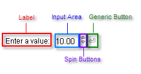

# Structure

The four types of **RadInput** controls (**RadTextBox**, **RadNumericTextBox**, **RadMaskedTextBox**, and **RadDateInput**) all have the same basic structure except that only RadNumericTextBox has spin buttons. This structure is illustrated below for **RadNumericTextBox**:

At a minimum, the **RadInput** control has an input area, where the user can type in a value. Optionally, the **RadInput** control can include up to three additional areas:

* If the **Label** property is set, a text label appears to the left of the input area.
* If the **ShowButton** property is **True**, a generic button appears to the side of the input area.

