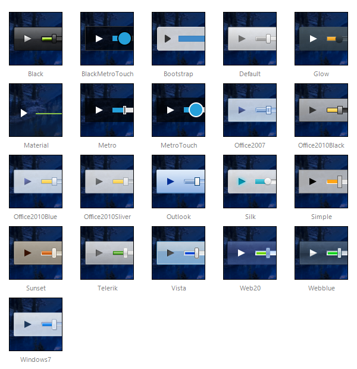

# Skins

**RadMediaPlayer** uses skins to control its overall look-and-feel. A skin is a set of images and a CSS stylesheet that can be applied to the control elements (items, images, etc.) and defines their look and feel. By default all controls in **UI for ASP.NET AJAX** suite have a polished look and feel which is consistent across the whole product line.

## Built-in skins

These are the skins provided by Telerik. They are embedded in the **Telerik.Web.UI.Skins.dll** assembly (except the Default one). To use a built-in skin you need to set the **Skin** property of the control.Below is a set of the Telerik **MediaPlayer** skins:

