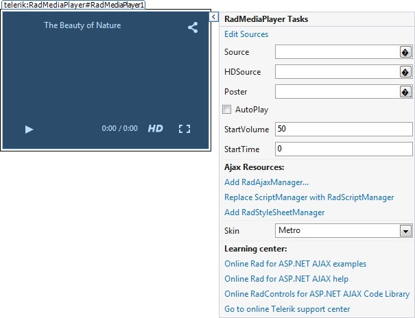

# Design Time

The __RadMediaPlayer__ designer provides a convenient __Smart Tag__ which allows easy access to frequently needed tasks. You can display it by right clicking on the control in the design window, and choosing __Show Smart Tag__ from its context menu, or by simply clicking on the arrow button on top-right corner of the control.

The __RadMediaPlayer__ Smart Tag lets you perform the following:

## RadMediaPlayer Tasks

* __Source__ - Enables you to pick up the path to the source media file to play.

* __HDSource__ - Enables you to pick up the path of the source media file to play in HD mode.

* __Poster__ - Enables you to pick up the path to the poster of the media.

* __AutoPlay__ - Indicates whether the media file will start playing on load.

* __StartVolume__ - Controls the start volume for the media player.

* __StartTime__ - Controls the start time for the media player.

## Ajax Resources

* __Add RadAjaxManager__ - adds a RadAjaxManager component to your Web page, and displays the __RadAjax Property Builder__ where you can configure it.

* __Replace ScriptManager with RadScriptManager__ - replaces the default __ScriptManager__ component that is added for AJAX-enabled Web sites with __RadScriptManager__.

* __Add RadStyleSheetManager__ - adds a __RadStyleSheetManager__ to your Web page.

## Skin

The __Skin__ drop-down lets you select from a list of available skins to customize the look of your __RadMediaPlayer__ control.

## Learning Center

Links navigate you directly to __RadMediaPlayer__ examples, help, or Code Library. You can also search the Telerik web site for a given string.

## Edit Sources

The __Edit Sources__ link brings up the __MediaPlayerSource Collection Editor__ which provides a straightforward and effortless way to add or remove sources to the player.

You can refer to the [Getting Started]() topic for an introduction sample with the designer.
