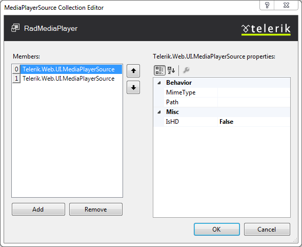

# Design Time

The **RadMediaPlayer** designer provides a convenient **Smart Tag** which allows easy access to frequently needed tasks. You can display it by right clicking on the control in the design window, and choosing **Show Smart Tag** from its context menu, or by simply clicking on the arrow button on top-right corner of the control.

The **RadMediaPlayer** Smart Tag lets you perform the following:

## RadMediaPlayer Tasks

* **Source** - Enables you to pick up the path to the source media file to play.

* **HDSource** - Enables you to pick up the path of the source media file to play in HD mode.

* **Poster** - Enables you to pick up the path to the poster of the media.

* **AutoPlay** - Indicates whether the media file will start playing on load.

* **StartVolume** - Controls the start volume for the media player.

* **StartTime** - Controls the start time for the media player.

## Ajax Resources

* **Add RadAjaxManager** - adds a RadAjaxManager component to your Web page, and displays the **RadAjax Property Builder** where you can configure it.

* **Replace ScriptManager with RadScriptManager** - replaces the default **ScriptManager** component that is added for AJAX-enabled Web sites with **RadScriptManager**.

* **Add RadStyleSheetManager** - adds a **RadStyleSheetManager** to your Web page.

## Skin

The **Skin** drop-down lets you select from a list of available skins to customize the look of your **RadMediaPlayer** control.

## Learning Center

Links navigate you directly to **RadMediaPlayer** examples, help, or Code Library. You can also search the Telerik web site for a given string.

## Edit Sources

The **Edit Sources** link brings up the **MediaPlayerSource Collection Editor** which provides a straightforward and effortless way to add or remove sources to the player.

You can refer to the [Getting Started]() topic for an introduction sample with the designer.
