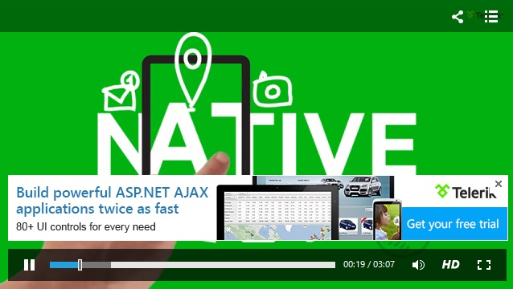

# Banners


## 

The Banners are the perfect tool in cases when you want to display your company logo, a helpful tip or any related link while playing your media file.

__For a given amount of time, the user can see and use the Banner as a navigation to external sources.__

## Defining the Banners

You can define your own custom Banners by adding __MediaPlayerBanner__ elements within the __RadMediaPlayer.Banners__ collection.

````ASPNET
	    <telerik:RadMediaPlayer ID="RadMediaPlayer1" runat="server" 
	        Title="Take a Tour of the Telerik Platform"
	        Height="360px" Width="640px"                
	        Source="http://www.youtube.com/watch?v=rLtTuFbuf1c">
	        <Banners>
	           <telerik:MediaPlayerBanner StartTime="5" EndTime="30" ImageUrl="~/banner.png"                 
	                ShowCloseButton="true"
	                AlternateText="Telerik UI Controls" 
	                NavigateURL="www.telerik.com/products/aspnet-ajax.aspx" />
	       </Banners>
	     </telerik:RadMediaPlayer>
````


## Configuration Settings

You can customize the Banner per your requirements inside any declared __MediaPlayerBanner__ tag. Short descriptionfor each of the settings is given below:

* __BannerCloseButtonToolTip:__ Defines the text ToolTip of the close buttons of the Banners. This option is available directlyin the main __RadMediaPlayer__ tag.

* __AlternateText:__ Defines the alternate text displayed in the Banner when the image is unavailable.

* __EndTime:__ Defines the hide time for the Banner.

* __ImageUrl:__ Defines the URL of the Banner image.

* __NavigateURL:__ Defines the Navigate URL of the Banner, which leads to an external source.

* __ShowCloseButton:__ Indicates whether the close button should be visible for the Banner.

* __StartTime:__ Defines the show time of the Banner.

* __Target:__ Controls the target window or frame that displays the Web page content, which the Banner links to.

* __ToolTip:__ Defines the text ToolTip of the image shown as banner.

## Controlling the Appearance

For altering and customizing the position and appearance of the Banner, you can make avail of the __rmpBanner__ class.

````ASPNET
	    <style type="text/css">
	        .rmpBanner {
	            margin-left: 30%;
	        }
	            .rmpBanner img {
	                width: 400px;
	            }
	    </style>
````


# See Also

 * [Overview]()

 * [Live Demo](http://demos.telerik.com/aspnet-ajax/media-player/examples/functionality/banners/defaultcs.aspx)

 * [Getting Started]()
