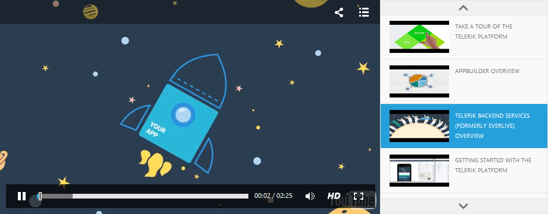

# Playlist


## 

The Playlist feature of **RadMediaPlayer** provides a user-friendly functionality to arrange and play multiple files by assembling them in a scrollable container holding all the media files.

**Users will be able to access the media files and choose the desired one.**

## Creating the Playlist

You can define your own custom Playlist by filling the **RadMediaPlayer** Playlist collection. This collection may contain both Audio and Video files. Every media file has properties for setting up its paths, poster, title, start volume, autoplay, etc.

````ASPNET
	    <telerik:RadMediaPlayer ID="RadMediaPlayer1" runat="server"
	        Height="360px" Width="640px" Source="">
	        <Playlist>
	            <telerik:MediaPlayerVideoFile Title="Icenium" Poster="icenium.png">
	                <Sources>
	                    <telerik:MediaPlayerSource Path="Video/icenium.mp4" />
	                </Sources>
	            </telerik:MediaPlayerVideoFile>
	            <telerik:MediaPlayerVideoFile Title="JustCode" Poster="justCode.png">
	                <Sources>
	                    <telerik:MediaPlayerSource Path="Video/justCode.mp4" />
	                </Sources>
	            </telerik:MediaPlayerVideoFile>
	        </Playlist>
	    </telerik:RadMediaPlayer>
````


Another way of populating the Playlist collection is by using the YouTube Playlist functionality located under the **RadMediaPlayer.PlaylistSettings**. The only required step is to specify an ID of a YouTube Playlist.

````ASPNET
	    <telerik:RadMediaPlayer ID="RadMediaPlayer1" runat="server" 
	       Height="360px" Width="640px">
	       <PlaylistSettings YouTubePlaylist="PL2563A3577E5B6B9D" />
	    </telerik:RadMediaPlayer>
````


## Configuration Settings

You can find the Playlist settings within the **RadMediaPlayer.PlaylistSettings** collection. Short description for each of the settings is given below.

* **SelectedIndex:** Gets or sets the index of the initially selected file in the Playlist.

* **Position:** Gets or sets an enumeration that determines the position of the UI representation of the playlist.

* **Mode:** Gets or sets an enumeration determining the mode of the Playlist. There are two modes available:

* **Scrollbar:** Enables the scrolling of the Playlist area using the default browser scrollbar. This is the default option.

* **Buttons:** The navigation of the Playlist area is done using two buttons on each side of the list, depending on its selected Position.

* **ButtonsTrigger** Gets or sets a property determining when the Playlist buttons will trigger their scroll functionality. Note that the property is only applicable when the Mode of the Playlist is set to Buttons.

# See Also

 * [Overview]()

 * [Live Demo](http://demos.telerik.com/aspnet-ajax/media-player/examples/overview/defaultcs.aspx)

 * [Getting Started]()
